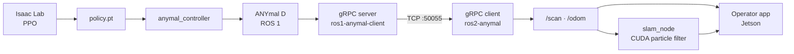

# anySLAM

Research into **SLAM, navigation and learned locomotion** on the **ANYmal D** quadruped robot, at
Tecnológico de Monterrey, Campus Monterrey.

This repository is the **project's entry point**: it holds no component code, only the map of
everything else.

*[Léelo en español](README.md)*

---

## Two ways to use this

| | |
| --- | --- |
| **Read the documentation** | A browsable web portal with search, in Spanish and English. Bring it up with `npm run dev` — see [Running the portal](#running-the-portal). |
| **Use the repo as a hub** | Everything is Markdown under [`docs/`](docs/), readable right here on GitHub. Diagrams are Mermaid, which GitHub renders natively. |

It is the same content by two routes. There is no "real" version and a fallback.

---

## Project index

Everything related to anySLAM, in one place.

### Code repositories

| Repository | Area | Maintainer |
| --- | --- | --- |
| [`Anymal-Research`](https://github.com/jesusMBhuy/Anymal-Research) | Reinforcement learning, locomotion | [@jesusMBhuy](https://github.com/jesusMBhuy) |
| [`ros2-anymal-slam`](https://github.com/Alponcho6594/ros2-anymal-slam) | SLAM and localisation | [@Alponcho6594](https://github.com/Alponcho6594) |
| [`ros1-anymal-client`](https://github.com/Alponcho6594/ros1-anymal-client) | Communication, ROS 1 bridge | [@Alponcho6594](https://github.com/Alponcho6594) |
| [`ANYmal_data_management`](https://github.com/Dravid-hex/ANYmal_data_management) | Operator interface on the Jetson | [@Dravid-hex](https://github.com/Dravid-hex) |
| [`FLOWMAS`](https://github.com/saucesaft/FLOWMAS) | Navigation, generative models | [@saucesaft](https://github.com/saucesaft) |

Four are private. The full catalog — with status, licence and **confidence level for every fact**
— is in [`docs/03-repositories/repository-catalog.en.mdx`](docs/03-repositories/repository-catalog.en.mdx).

### Management and research

| Resource | Purpose |
| --- | --- |
| [Kanban board — Azure DevOps](https://dev.azure.com/EI-AD2026-Robotica) | Weekly sprints, six work areas. Requires a Microsoft Entra account. |
| [ICRA 2025 poster](https://haironthecircuits.net/wiki/icra2025/) | *Flow Matching Architecture for Navigation* — the team's published work. |

### The split

> The **board** says what is being worked on this week.
> This **repository** says how the system is built.
> Each **component repository** says how it works internally and how to run it.

That separation is deliberate and is explained in [scope](docs/01-introduction/scope.en.mdx). It
keeps the same information from living in two places and eventually contradicting itself.

---

## Architecture at a glance



The detail, with the real topics and gRPC contract, is in
[system overview](docs/02-architecture/system-overview.en.mdx).

---

## The documentation

### Start here

- [**Getting started**](docs/08-onboarding/getting-started.en.mdx) — from zero context to understanding the project.
- [**Project map**](docs/08-onboarding/project-map.en.mdx) — the ten questions you should be able to answer, and where they are answered.
- [**Overview**](docs/01-introduction/overview.en.mdx) — what anySLAM is and who develops it.

### All sections

| Section | Contents |
| --- | --- |
| [`01-introduction/`](docs/01-introduction/) | [Overview](docs/01-introduction/overview.en.mdx) · [Goals](docs/01-introduction/goals.en.mdx) · [Scope](docs/01-introduction/scope.en.mdx) |
| [`02-architecture/`](docs/02-architecture/) | [System](docs/02-architecture/system-overview.en.mdx) · [Hardware](docs/02-architecture/hardware-architecture.en.mdx) · [Software](docs/02-architecture/software-architecture.en.mdx) · [Network](docs/02-architecture/network-architecture.en.mdx) · [Data flow](docs/02-architecture/data-flow.en.mdx) |
| [`03-repositories/`](docs/03-repositories/) | [Organisation](docs/03-repositories/overview.en.mdx) · [Catalog](docs/03-repositories/repository-catalog.en.mdx) · [Missing data](docs/03-repositories/missing-data.en.mdx) |
| [`04-hardware/`](docs/04-hardware/) | [ANYmal D](docs/04-hardware/anymal-d.en.mdx) · [LiDAR](docs/04-hardware/lidar.en.mdx) · [Cameras](docs/04-hardware/cameras.en.mdx) · [Compute](docs/04-hardware/compute.en.mdx) · [Sensors](docs/04-hardware/sensors.en.mdx) |
| [`05-software/`](docs/05-software/) | [ROS](docs/05-software/ros.en.mdx) · [SLAM](docs/05-software/slam.en.mdx) · [Vision](docs/05-software/vision.en.mdx) · [Learned policies](docs/05-software/learning.en.mdx) · [Communication](docs/05-software/communication.en.mdx) |
| [`06-infrastructure/`](docs/06-infrastructure/) | [Docker](docs/06-infrastructure/docker.en.mdx) · [Networking](docs/06-infrastructure/networking.en.mdx) · [Development environment](docs/06-infrastructure/development-environment.en.mdx) |
| [`07-standards/`](docs/07-standards/) | [Repository standard](docs/07-standards/repository-standard.en.mdx) · [README template](docs/07-standards/readme-standard.en.mdx) · [Git workflow](docs/07-standards/git-workflow.en.mdx) · [Documentation standard](docs/07-standards/documentation-standard.en.mdx) |
| [`08-onboarding/`](docs/08-onboarding/) | [Getting started](docs/08-onboarding/getting-started.en.mdx) · [Development setup](docs/08-onboarding/development-setup.en.mdx) · [Project map](docs/08-onboarding/project-map.en.mdx) |
| [`09-research/`](docs/09-research/) | [Publications](docs/09-research/papers.en.mdx) · [Experiments](docs/09-research/experiments.en.mdx) · [Datasets](docs/09-research/datasets.en.mdx) |
| [`10-roadmap/`](docs/10-roadmap/) | [Roadmap](docs/10-roadmap/roadmap.en.mdx) |

Every page exists in two languages: `page.mdx` in Spanish and `page.en.mdx` in English.

---

## Running the portal

You need **Node.js 20.9 or newer**. Nothing else: no ROS, no Docker, no robot.

```bash
npm install
npm run dev
```

It comes up at `http://localhost:3000` and redirects to `/es`. The language switcher is in the
top bar.

| Command | What it does |
| --- | --- |
| `npm run dev` | Serves the portal locally |
| `npm run build` | Compiles and validates every page |
| `npm run gen:catalog` | Regenerates the catalog from `data/repositories.yaml` |

The portal is built with **Next.js 16 + Fumadocs 16**: built-in search, bilingual navigation with
automatic fallback to Spanish, and server-rendered Mermaid diagrams.

> **Not deployed yet.** Where it is hosted and under what URL is still undecided — tracked in
> [missing data](docs/03-repositories/missing-data.en.mdx).

---

## Exporting a page as Markdown

Every portal page has a **Copy Markdown** button at the top. You can also append `.md` to any URL
to get the content as plain text:

```
/en/docs/05-software/slam       → the page
/en/docs/05-software/slam.md    → its Markdown
```

Useful for pasting a section into an issue or the board, or for giving an AI assistant context
without copying by hand.

---

## Cloning every repository

```bash
./scripts/bootstrap.sh
```

Clones the catalog's repositories into `../anyslam-workspace`. Private ones you lack access to
are reported without stopping the process.

---

## Repository structure

```
docs/          the documentation, bilingual (.mdx = Spanish, .en.mdx = English)
data/          repositories.yaml — single source of truth for the repo catalog
templates/     README template and intake questionnaire
scripts/       gen-catalog.mjs and bootstrap.sh
app/ lib/      the Next.js portal application
components/    MDX components (Mermaid, Callout, copy Markdown)
```

---

## Contributing

See [CONTRIBUTING.md](CONTRIBUTING.md). In short:

- Every page exists in Spanish and English.
- The catalog is generated from `data/repositories.yaml`; do not edit the generated pages.
- `npm run build` must pass before opening a Pull Request.
- **A visible gap is better than an invented description.** Anything unverified is marked as
  pending, naming who the fact depends on.

**If you maintain a project repository**, the most useful thing you can do is fill in
[`templates/repo-intake.md`](templates/repo-intake.md): twelve questions that close most of what
is currently missing.

---

## Status

| Phase | Status |
| --- | --- |
| 1 — Foundation | ✅ |
| 2 — Standardization | ✅ (teams still need to adopt it) |
| 3 — Portal | ✅ (not deployed yet) |
| 4 — Automation | 🔜 GitHub Actions, automatic metadata |
| 5 — Project Brain | 🔮 semantic search over the project's knowledge |

What is still undocumented, and who each fact depends on, is in
[missing data](docs/03-repositories/missing-data.en.mdx). The main gap today is the **physical
hardware**: we know which topic each sensor publishes, but not which sensor it is.
