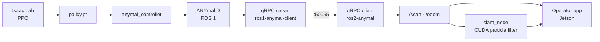

# anySLAM

**Central documentation portal** for the SLAM, navigation and learned-locomotion research
project running on the **ANYmal D** quadruped robot, developed at Tecnológico de Monterrey,
Campus Monterrey.

*[Léelo en español](README.md)*

---

## What this is

The project lives across five repositories owned by different people. This portal **neither
replaces them nor copies their technical documentation**: it provides the unified view of the
system and answers what exists, why, where it is, who maintains it, and how the pieces fit.

How to install, configure and run each component is documented in that component's own
repository.

## Architecture at a glance



## Where each thing lives

| You need | Go to |
| --- | --- |
| To know what to work on this week | [Kanban board on Azure DevOps](https://dev.azure.com/EI-AD2026-Robotica) |
| To understand how the system is built | This portal |
| A component's code | Its repository, below |

## The repositories

| Repository | Area | Maintainer |
| --- | --- | --- |
| [`Anymal-Research`](https://github.com/jesusMBhuy/Anymal-Research) | Learning / locomotion | [@jesusMBhuy](https://github.com/jesusMBhuy) |
| [`ros2-anymal-slam`](https://github.com/Alponcho6594/ros2-anymal-slam) | SLAM and localisation | [@Alponcho6594](https://github.com/Alponcho6594) |
| [`ros1-anymal-client`](https://github.com/Alponcho6594/ros1-anymal-client) | Communication / ROS 1 | [@Alponcho6594](https://github.com/Alponcho6594) |
| [`ANYmal_data_management`](https://github.com/Dravid-hex/ANYmal_data_management) | Operator interface | [@Dravid-hex](https://github.com/Dravid-hex) |
| [`FLOWMAS`](https://github.com/saucesaft/FLOWMAS) | Navigation / generative models | [@saucesaft](https://github.com/saucesaft) |

The full catalog, with each item's status and confidence level, is in
[`docs/03-repositories/repository-catalog.en.mdx`](docs/03-repositories/repository-catalog.en.mdx).

## Running the portal

You need Node.js 20.9 or newer.

```bash
npm install
npm run dev
```

It comes up at `http://localhost:3000`. It is bilingual: `/es` and `/en`.

## Copying a page as Markdown

Every page has a **Copy Markdown** button at the top. You can also append `.md` to any URL to get
the content as plain text:

```
/en/docs/05-software/slam.md
```

## Reading without the portal

All content is Markdown files under [`docs/`](docs/), readable straight from GitHub. Diagrams are
Mermaid, which GitHub renders natively.

| Section | What it holds |
| --- | --- |
| [`01-introduction/`](docs/01-introduction/) | What the project is, goals and scope |
| [`02-architecture/`](docs/02-architecture/) | Hardware, software, network and data-flow architecture |
| [`03-repositories/`](docs/03-repositories/) | Repository catalog and missing data |
| [`04-hardware/`](docs/04-hardware/) | ANYmal D, LiDAR, cameras, compute, sensors |
| [`05-software/`](docs/05-software/) | ROS, SLAM, vision, learning, communication |
| [`06-infrastructure/`](docs/06-infrastructure/) | Docker, networking, development environment |
| [`07-standards/`](docs/07-standards/) | Repository, README and documentation standards |
| [`08-onboarding/`](docs/08-onboarding/) | Getting started and project map |
| [`09-research/`](docs/09-research/) | Publications, experiments and datasets |
| [`10-roadmap/`](docs/10-roadmap/) | Portal phases and their status |

## Repository structure

```
docs/          bilingual content (.mdx = Spanish, .en.mdx = English)
data/          repositories.yaml — single source of truth for the catalog
templates/     README template and intake questionnaire
scripts/       gen-catalog.mjs and bootstrap.sh
app/ lib/      the Next.js portal application
idea/          the original document this project grew from
```

## Cloning every repository

```bash
./scripts/bootstrap.sh
```

Clones the catalog's repositories into `../anyslam-workspace`. Private ones you lack access to
are reported without stopping the process.

## Contributing

See [CONTRIBUTING.md](CONTRIBUTING.md). In short: every page exists in Spanish and English, the
catalog is generated from the YAML, and `npm run build` must pass before opening a Pull Request.

**If you maintain a project repository**, the most useful thing you can do is fill in
[`templates/repo-intake.md`](templates/repo-intake.md): twelve questions that close most of what
is currently missing.

## Status

| Phase | Status |
| --- | --- |
| 1 — Foundation | ✅ |
| 2 — Standardization | ✅ (teams still need to adopt it) |
| 3 — Portal | ✅ (not deployed yet) |
| 4 — Automation | 🔜 |
| 5 — Project Brain | 🔮 |

Outstanding items are in
[`docs/03-repositories/missing-data.en.mdx`](docs/03-repositories/missing-data.en.mdx).
