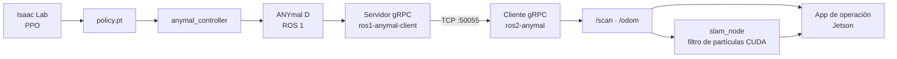

# anySLAM

Investigación en **SLAM, navegación y locomoción aprendida** sobre el robot cuadrúpedo
**ANYmal D**, en el Tecnológico de Monterrey, Campus Monterrey.

Este repositorio es el **punto de entrada del proyecto**: no contiene el código de los
componentes, sino el mapa de todo lo demás.

*[Read this in English](README.en.md)*

---

## Dos formas de usar esto

| | |
| --- | --- |
| **Leer la documentación** | Un portal web navegable, con buscador y en español e inglés. Levántalo con `npm run dev` — ver [Ejecutar el portal](#ejecutar-el-portal). |
| **Usar el repo como hub** | Todo es Markdown en [`docs/`](docs/), legible aquí mismo en GitHub. Los diagramas están en Mermaid, que GitHub renderiza solo. |

Es el mismo contenido por dos caminos. No hay una versión "buena" y otra "de respaldo".

---

## Índice del proyecto

Todo lo relacionado con anySLAM, en un solo lugar.

### Repositorios de código

| Repositorio | Área | Responsable |
| --- | --- | --- |
| [`Anymal-Research`](https://github.com/jesusMBhuy/Anymal-Research) | Aprendizaje por refuerzo, locomoción | [@jesusMBhuy](https://github.com/jesusMBhuy) |
| [`ros2-anymal-slam`](https://github.com/Alponcho6594/ros2-anymal-slam) | SLAM y localización | [@Alponcho6594](https://github.com/Alponcho6594) |
| [`ros1-anymal-client`](https://github.com/Alponcho6594/ros1-anymal-client) | Comunicación, puente ROS 1 | [@Alponcho6594](https://github.com/Alponcho6594) |
| [`ANYmal_data_management`](https://github.com/Dravid-hex/ANYmal_data_management) | Interfaz de operación en la Jetson | [@Dravid-hex](https://github.com/Dravid-hex) |
| [`FLOWMAS`](https://github.com/saucesaft/FLOWMAS) | Navegación, modelos generativos | [@saucesaft](https://github.com/saucesaft) |

Cuatro son privados. El catálogo completo, con estado, licencia y **nivel de verificación de cada
dato**, está en [`docs/03-repositories/repository-catalog.mdx`](docs/03-repositories/repository-catalog.mdx).

### Gestión e investigación

| Recurso | Para qué |
| --- | --- |
| [Tablero Kanban — Azure DevOps](https://dev.azure.com/EI-AD2026-Robotica) | Sprints semanales, seis áreas de trabajo. Requiere cuenta Microsoft Entra. |
| [Póster ICRA 2025](https://haironthecircuits.net/wiki/icra2025/) | *Flow Matching Architecture for Navigation* — el trabajo publicado del equipo. |

### El reparto

> El **tablero** dice qué se está haciendo esta semana.
> Este **repositorio** dice cómo está construido el sistema.
> Cada **repositorio de componente** dice cómo funciona por dentro y cómo ejecutarlo.

Esa separación es deliberada y está explicada en
[alcance](docs/01-introduction/scope.mdx). Evita que la misma información viva en dos sitios y
acabe contradiciéndose.

---

## Arquitectura en una imagen



El detalle, con los tópicos y el contrato gRPC reales, está en
[visión general del sistema](docs/02-architecture/system-overview.mdx).

---

## La documentación

### Empieza aquí

- [**Primeros pasos**](docs/08-onboarding/getting-started.mdx) — de cero contexto a entender el proyecto.
- [**Mapa del proyecto**](docs/08-onboarding/project-map.mdx) — las diez preguntas que deberías poder responder, y dónde se responden.
- [**Visión general**](docs/01-introduction/overview.mdx) — qué es anySLAM y quién lo desarrolla.

### Todas las secciones

| Sección | Contenido |
| --- | --- |
| [`01-introduction/`](docs/01-introduction/) | [Visión general](docs/01-introduction/overview.mdx) · [Objetivos](docs/01-introduction/goals.mdx) · [Alcance](docs/01-introduction/scope.mdx) |
| [`02-architecture/`](docs/02-architecture/) | [Sistema](docs/02-architecture/system-overview.mdx) · [Hardware](docs/02-architecture/hardware-architecture.mdx) · [Software](docs/02-architecture/software-architecture.mdx) · [Red](docs/02-architecture/network-architecture.mdx) · [Flujo de datos](docs/02-architecture/data-flow.mdx) |
| [`03-repositories/`](docs/03-repositories/) | [Organización](docs/03-repositories/overview.mdx) · [Catálogo](docs/03-repositories/repository-catalog.mdx) · [Datos pendientes](docs/03-repositories/missing-data.mdx) |
| [`04-hardware/`](docs/04-hardware/) | [ANYmal D](docs/04-hardware/anymal-d.mdx) · [LiDAR](docs/04-hardware/lidar.mdx) · [Cámaras](docs/04-hardware/cameras.mdx) · [Cómputo](docs/04-hardware/compute.mdx) · [Sensores](docs/04-hardware/sensors.mdx) |
| [`05-software/`](docs/05-software/) | [ROS](docs/05-software/ros.mdx) · [SLAM](docs/05-software/slam.mdx) · [Visión](docs/05-software/vision.mdx) · [Políticas aprendidas](docs/05-software/learning.mdx) · [Comunicación](docs/05-software/communication.mdx) |
| [`06-infrastructure/`](docs/06-infrastructure/) | [Docker](docs/06-infrastructure/docker.mdx) · [Redes](docs/06-infrastructure/networking.mdx) · [Entorno de desarrollo](docs/06-infrastructure/development-environment.mdx) |
| [`07-standards/`](docs/07-standards/) | [Estándar de repositorio](docs/07-standards/repository-standard.mdx) · [Plantilla de README](docs/07-standards/readme-standard.mdx) · [Flujo con Git](docs/07-standards/git-workflow.mdx) · [Estándar de documentación](docs/07-standards/documentation-standard.mdx) |
| [`08-onboarding/`](docs/08-onboarding/) | [Primeros pasos](docs/08-onboarding/getting-started.mdx) · [Preparar el entorno](docs/08-onboarding/development-setup.mdx) · [Mapa del proyecto](docs/08-onboarding/project-map.mdx) |
| [`09-research/`](docs/09-research/) | [Publicaciones](docs/09-research/papers.mdx) · [Experimentos](docs/09-research/experiments.mdx) · [Datasets](docs/09-research/datasets.mdx) |
| [`10-roadmap/`](docs/10-roadmap/) | [Roadmap](docs/10-roadmap/roadmap.mdx) |

Cada página existe en dos idiomas: `pagina.mdx` en español y `pagina.en.mdx` en inglés.

---

## Ejecutar el portal

Necesitas **Node.js 20.9 o superior**. Nada más: no hace falta ROS, ni Docker, ni el robot.

```bash
npm install
npm run dev
```

Queda en `http://localhost:3000` y redirige a `/es`. El selector de idioma está en la barra
superior.

| Comando | Qué hace |
| --- | --- |
| `npm run dev` | Levanta el portal en local |
| `npm run build` | Compila y valida todas las páginas |
| `npm run gen:catalog` | Regenera el catálogo desde `data/repositories.yaml` |

El portal está hecho con **Next.js 16 + Fumadocs 16**: búsqueda integrada, navegación bilingüe
con retroceso automático al español, y diagramas Mermaid renderizados en el servidor.

> **Aún no está desplegado.** Falta decidir dónde se aloja y con qué URL — anotado en
> [datos pendientes](docs/03-repositories/missing-data.mdx).

---

## Exportar una página como Markdown

Cada página del portal tiene arriba un botón **Copiar Markdown**. También puedes añadir `.md` a
cualquier URL para obtener el contenido en texto plano:

```
/es/docs/05-software/slam       → la página
/es/docs/05-software/slam.md    → su Markdown
```

Sirve para pegar una sección en un issue, en el tablero, o para dar contexto a un asistente de IA
sin copiar a mano.

---

## Clonar todos los repositorios

```bash
./scripts/bootstrap.sh
```

Clona en `../anyslam-workspace` los repositorios del catálogo. Los privados a los que no tengas
acceso se reportan sin detener el proceso.

---

## Estructura del repositorio

```
docs/          la documentación, bilingüe (.mdx = español, .en.mdx = inglés)
data/          repositories.yaml — fuente única del catálogo de repos
templates/     plantilla de README y cuestionario de intake
scripts/       gen-catalog.mjs y bootstrap.sh
app/ lib/      la aplicación Next.js del portal
components/    componentes MDX (Mermaid, Callout, copiar Markdown)
```

---

## Contribuir

Ver [CONTRIBUTING.md](CONTRIBUTING.md). En resumen:

- Cada página existe en español e inglés.
- El catálogo se genera desde `data/repositories.yaml`; no edites las páginas generadas.
- `npm run build` debe pasar antes de abrir un Pull Request.
- **Un hueco visible es mejor que una descripción inventada.** Lo que no esté verificado se marca
  como pendiente, diciendo de quién depende el dato.

**Si mantienes un repositorio del proyecto**, lo más útil que puedes hacer es llenar
[`templates/repo-intake.md`](templates/repo-intake.md): doce preguntas que cierran la mayor parte
de lo que hoy falta.

---

## Estado

| Fase | Estado |
| --- | --- |
| 1 — Foundation | ✅ |
| 2 — Standardization | ✅ (falta que los equipos la adopten) |
| 3 — Portal | ✅ (falta desplegarlo) |
| 4 — Automation | 🔜 GitHub Actions, metadatos automáticos |
| 5 — Project Brain | 🔮 búsqueda semántica sobre el conocimiento del proyecto |

Lo que falta por documentar, y de quién depende cada dato, está en
[datos pendientes](docs/03-repositories/missing-data.mdx). El hueco principal hoy es el
**hardware físico**: sabemos qué tópico publica cada sensor, pero no qué sensor es.
