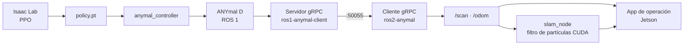

# anySLAM

**Portal central de documentación** del proyecto de investigación en SLAM, navegación y
locomoción aprendida sobre el robot cuadrúpedo **ANYmal D**, desarrollado en el Tecnológico de
Monterrey, Campus Monterrey.

*[Read this in English](README.en.md)*

---

## Qué es esto

El proyecto vive en cinco repositorios de distintos dueños. Este portal **no los reemplaza ni
copia su documentación técnica**: da la vista unificada del sistema y responde qué existe, por
qué, dónde está, quién lo mantiene y cómo encajan las piezas.

Cómo instalar, configurar y ejecutar cada componente se documenta en el repositorio de ese
componente.

## Arquitectura en una imagen



## Dónde está cada cosa

| Necesitas | Ve a |
| --- | --- |
| Saber en qué trabajar esta semana | [Tablero Kanban en Azure DevOps](https://dev.azure.com/EI-AD2026-Robotica) |
| Entender cómo está construido el sistema | Este portal |
| El código de un componente | Su repositorio, abajo |

## Los repositorios

| Repositorio | Área | Responsable |
| --- | --- | --- |
| [`Anymal-Research`](https://github.com/jesusMBhuy/Anymal-Research) | Aprendizaje / locomoción | [@jesusMBhuy](https://github.com/jesusMBhuy) |
| [`ros2-anymal-slam`](https://github.com/Alponcho6594/ros2-anymal-slam) | SLAM y localización | [@Alponcho6594](https://github.com/Alponcho6594) |
| [`ros1-anymal-client`](https://github.com/Alponcho6594/ros1-anymal-client) | Comunicación / ROS 1 | [@Alponcho6594](https://github.com/Alponcho6594) |
| [`ANYmal_data_management`](https://github.com/Dravid-hex/ANYmal_data_management) | Interfaz de operación | [@Dravid-hex](https://github.com/Dravid-hex) |
| [`FLOWMAS`](https://github.com/saucesaft/FLOWMAS) | Navegación / modelos generativos | [@saucesaft](https://github.com/saucesaft) |

El catálogo completo, con estado y nivel de verificación de cada dato, está en
[`docs/03-repositories/repository-catalog.mdx`](docs/03-repositories/repository-catalog.mdx).

## Ejecutar el portal

Necesitas Node.js 20.9 o superior.

```bash
npm install
npm run dev
```

Queda en `http://localhost:3000`. Es bilingüe: `/es` y `/en`.

## Copiar una página como Markdown

Cada página tiene arriba un botón **Copiar Markdown**. También puedes añadir `.md` a cualquier
URL para obtener el contenido en texto plano:

```
/es/docs/05-software/slam.md
```

## Leer sin el portal

Todo el contenido son archivos Markdown en [`docs/`](docs/), legibles directamente desde GitHub.
Los diagramas están en Mermaid, que GitHub renderiza de forma nativa.

| Sección | Qué contiene |
| --- | --- |
| [`01-introduction/`](docs/01-introduction/) | Qué es el proyecto, objetivos y alcance |
| [`02-architecture/`](docs/02-architecture/) | Arquitectura de hardware, software, red y flujo de datos |
| [`03-repositories/`](docs/03-repositories/) | Catálogo de repositorios y datos pendientes |
| [`04-hardware/`](docs/04-hardware/) | ANYmal D, LiDAR, cámaras, cómputo, sensores |
| [`05-software/`](docs/05-software/) | ROS, SLAM, visión, aprendizaje, comunicación |
| [`06-infrastructure/`](docs/06-infrastructure/) | Docker, red, entorno de desarrollo |
| [`07-standards/`](docs/07-standards/) | Estándares de repositorio, README y documentación |
| [`08-onboarding/`](docs/08-onboarding/) | Primeros pasos y mapa del proyecto |
| [`09-research/`](docs/09-research/) | Publicaciones, experimentos y datasets |
| [`10-roadmap/`](docs/10-roadmap/) | Fases del portal y su estado |

## Estructura del repositorio

```
docs/          contenido bilingüe (.mdx = español, .en.mdx = inglés)
data/          repositories.yaml — fuente única del catálogo
templates/     plantilla de README y cuestionario de intake
scripts/       gen-catalog.mjs y bootstrap.sh
app/ lib/      la aplicación Next.js del portal
idea/          el documento original que originó este proyecto
```

## Clonar todos los repositorios

```bash
./scripts/bootstrap.sh
```

Clona los repositorios del catálogo en `../anyslam-workspace`. Los que sean privados y a los que
no tengas acceso se reportan sin detener el proceso.

## Contribuir

Ver [CONTRIBUTING.md](CONTRIBUTING.md). En resumen: cada página existe en español e inglés, el
catálogo se genera desde el YAML, y `npm run build` debe pasar antes de abrir un Pull Request.

**Si mantienes un repositorio del proyecto**, lo más útil que puedes hacer es llenar
[`templates/repo-intake.md`](templates/repo-intake.md): doce preguntas que cierran la mayor parte
de lo que hoy falta.

## Estado

| Fase | Estado |
| --- | --- |
| 1 — Foundation | ✅ |
| 2 — Standardization | ✅ (falta que los equipos la adopten) |
| 3 — Portal | ✅ (falta desplegarlo) |
| 4 — Automation | 🔜 |
| 5 — Project Brain | 🔮 |

Lo pendiente está en
[`docs/03-repositories/missing-data.mdx`](docs/03-repositories/missing-data.mdx).
