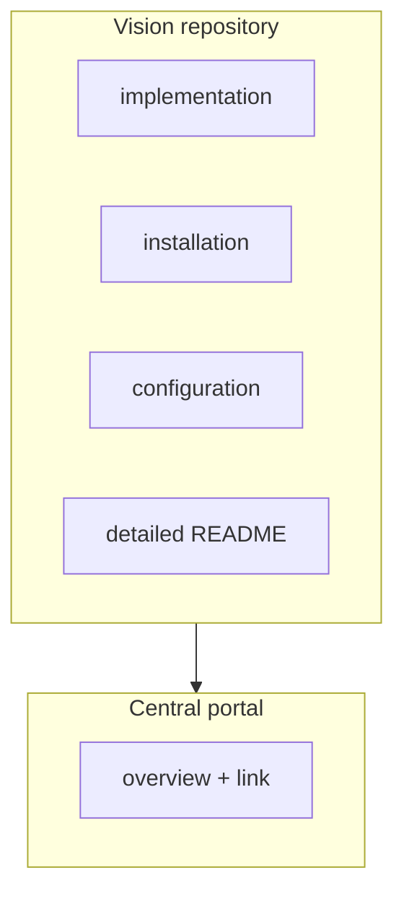

The rule that avoids duplicating documentation — and with it, avoids two pages contradicting
each other — is this:

> Detailed information lives as close as possible to the code it describes.

## The split

| The central portal documents | Each repository documents |
| --- | --- |
| **WHAT** exists | **HOW** it works internally |
| **WHY** it exists | **HOW** to install it |
| **WHERE** it is | **HOW** to configure it |
| **WHO** maintains it | **HOW** to develop it |
| **HOW** it relates to everything else | **HOW** to test it |

Put differently: if the answer changes when someone lands a commit in a repository, the answer
belongs to that repository. If the answer only changes when the shape of the system changes, it
belongs here.

## Explicitly out of scope

- **Copying repository READMEs.** The portal links, it does not duplicate.
- **Documenting every commit.** The portal is updated when the global understanding of the
  system changes, not on every code change. The triggers are in
  [git workflow](/en/docs/07-standards/git-workflow).
- **Hosting component code.** This repository contains only documentation, the portal
  configuration and helper scripts.
- **Being the source of truth for versions.** Releases and tags live in each repository.

## When to update the portal

When a change affects how the whole system is understood:

- A repository is created or removed.
- A component changes maintainer.
- The architecture changes in a meaningful way.
- A new dependency appears between components.
- A sensor is added or removed.
- A protocol or public interface changes (topics, services, APIs, ports).
- The data flow changes significantly.
