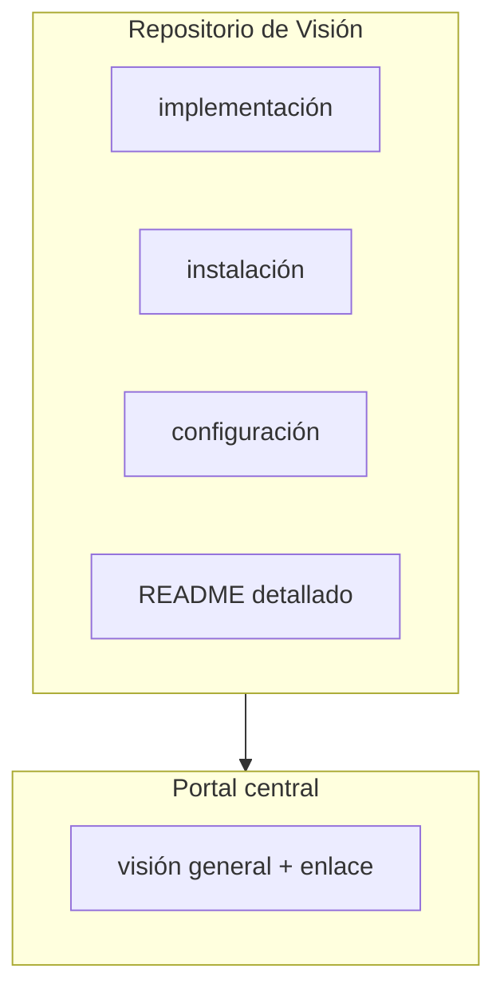

La regla que evita duplicar documentación —y con ello, evitar que dos páginas se contradigan— es
esta:

> La información detallada vive lo más cerca posible del código que describe.

## El reparto

| El portal central documenta | Cada repositorio documenta |
| --- | --- |
| **QUÉ** existe | **CÓMO** funciona por dentro |
| **POR QUÉ** existe | **CÓMO** instalarlo |
| **DÓNDE** está | **CÓMO** configurarlo |
| **QUIÉN** lo mantiene | **CÓMO** desarrollarlo |
| **CÓMO** se relaciona con lo demás | **CÓMO** probarlo |

Dicho de otro modo: si la respuesta cambia cuando alguien hace un commit en un repositorio,
la respuesta pertenece a ese repositorio. Si la respuesta solo cambia cuando cambia la forma del
sistema, pertenece aquí.

## Qué está explícitamente fuera de alcance

- **Copiar los README** de los repositorios. El portal enlaza, no duplica.
- **Documentar cada commit.** El portal se actualiza cuando cambia la comprensión global del
  sistema, no en cada cambio de código. Los disparadores están en
  [flujo de trabajo](/es/docs/07-standards/git-workflow).
- **Alojar código de los componentes.** Este repositorio solo contiene documentación, la
  configuración del portal y scripts auxiliares.
- **Ser la fuente de verdad de versiones.** Los releases y tags viven en cada repositorio.

## Cuándo actualizar el portal

Cuando ocurre un cambio que afecta cómo se entiende el sistema completo:

- Se crea o se elimina un repositorio.
- Cambia el responsable de un componente.
- Cambia la arquitectura de forma relevante.
- Aparece una dependencia nueva entre componentes.
- Se añade o se retira un sensor.
- Cambia un protocolo o una interfaz pública (topics, servicios, APIs, puertos).
- Cambia de forma importante el flujo de datos.
