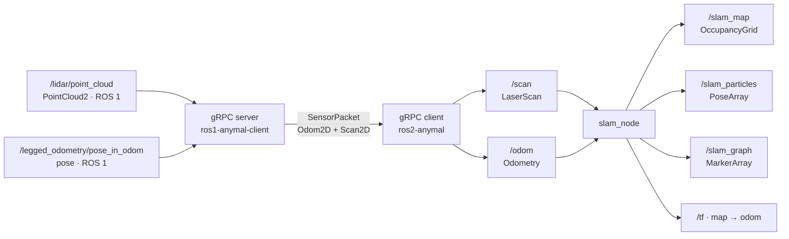
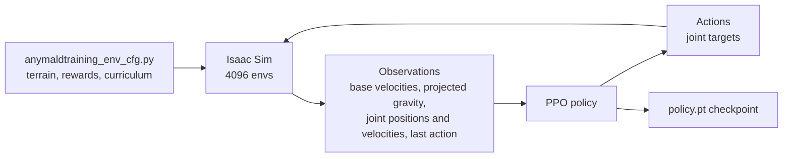

## Operation and SLAM flow

The `PointCloud2` to `Scan2D` conversion is where the system goes from 3D to 2D. Everything after
it — map, particles, graph — is planar.

## Interface table

| Component | Publishes | Subscribes | Transport |
| --- | --- | --- | --- |
| ANYmal (ROS 1) | `/lidar/point_cloud`, `/legged_odometry/pose_in_odom` | control commands | ROS 1 |
| gRPC server | `SensorPacket` stream | the ROS 1 topics above | ROS 1 → gRPC |
| gRPC client | `/scan`, `/odom` | gRPC stream | gRPC → ROS 2 |
| `slam_node` | `/slam_map`, `/slam_particles`, `/slam_graph`, `/tf` | `/scan`, `/odom` | ROS 2 |
| `slam_node` (MCL) | `/static_map`, `/mcl_pose`, `/mcl_particles`, `/tf` | `/scan`, `/odom` | ROS 2 |
| Operator app | — | `/scan`, `/odom`, cameras | ROS 2 |
| `anymal_controller` | *pending* | *pending* | ROS 2 |

The only row still pending is the locomotion controller's. See
[communication](/en/docs/05-software/communication) for message types and the gRPC contract.

## Reference frames

| Transform | Published by |
| --- | --- |
| `map → odom` | `slam_node` |
| `odom → base_link` | the robot (and `fake_publisher.py` in robot-free testing) |

## Training flow

Details in [learned policies](/en/docs/05-software/learning).

## Recorded data

Experiments are recorded at two levels:

| Level | Tool | Repository |
| --- | --- | --- |
| ROS 1 (raw from the robot) | rosbag | `ros1-anymal-client` |
| ROS 2 (already converted) | `record_ros2_exp.sh` / ROS 2 bags | `ros2-anymal-slam` |

Resulting maps are saved per experiment (`exp1.pgm` / `exp1.yaml`, …), which allows replaying a
full run without the robot via `play_ros2_exp.sh`.

<Callout type="warn" title="Pending">
Where bags and maps are archived long term, how much space they take, and whether there is a
versioning policy still need documenting. See [datasets](/en/docs/09-research/datasets).
</Callout>
