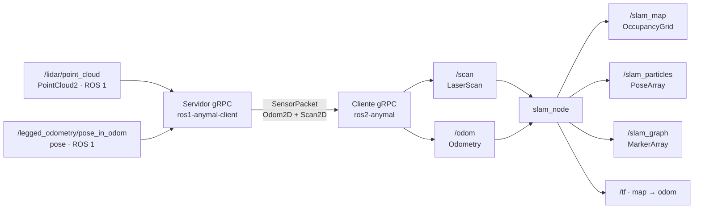
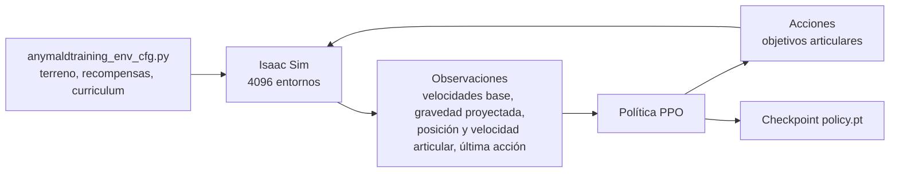

## Flujo de operación y SLAM

La conversión de `PointCloud2` a `Scan2D` es el punto donde el sistema pasa de 3D a 2D. Todo lo
que ocurre después —mapa, partículas, grafo— es planar.

## Tabla de interfaces

| Componente | Publica | Suscribe | Transporte |
| --- | --- | --- | --- |
| ANYmal (ROS 1) | `/lidar/point_cloud`, `/legged_odometry/pose_in_odom` | comandos de control | ROS 1 |
| Servidor gRPC | stream `SensorPacket` | tópicos ROS 1 de arriba | ROS 1 → gRPC |
| Cliente gRPC | `/scan`, `/odom` | stream gRPC | gRPC → ROS 2 |
| `slam_node` | `/slam_map`, `/slam_particles`, `/slam_graph`, `/tf` | `/scan`, `/odom` | ROS 2 |
| `slam_node` (MCL) | `/static_map`, `/mcl_pose`, `/mcl_particles`, `/tf` | `/scan`, `/odom` | ROS 2 |
| App de operación | — | `/scan`, `/odom`, cámaras | ROS 2 |
| `anymal_controller` | *pendiente* | *pendiente* | ROS 2 |

La única fila que sigue pendiente es la del controlador de locomoción. Ver
[comunicación](/es/docs/05-software/communication) para el detalle de tipos y del contrato gRPC.

## Marcos de referencia

| Transformada | Quién la publica |
| --- | --- |
| `map → odom` | `slam_node` |
| `odom → base_link` | el robot (y `fake_publisher.py` en pruebas sin robot) |

## Flujo de entrenamiento

Detalle en [políticas aprendidas](/es/docs/05-software/learning).

## Datos grabados

Los experimentos se graban en dos niveles:

| Nivel | Herramienta | Repositorio |
| --- | --- | --- |
| ROS 1 (crudo del robot) | rosbag | `ros1-anymal-client` |
| ROS 2 (ya convertido) | `record_ros2_exp.sh` / bags de ROS 2 | `ros2-anymal-slam` |

Los mapas resultantes se guardan por experimento (`exp1.pgm` / `exp1.yaml`, …), lo que permite
reproducir una corrida completa sin el robot con `play_ros2_exp.sh`.

<Callout type="warn" title="Pendiente">
Falta documentar dónde se archivan los bags y los mapas a largo plazo, cuánto ocupan y si hay
una política de versionado. Ver [datasets](/es/docs/09-research/datasets).
</Callout>
