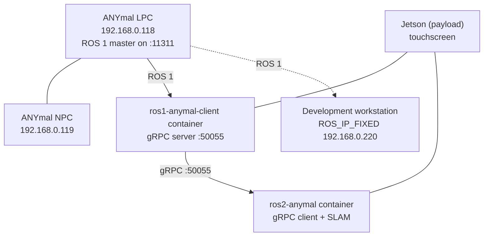

<Callout type="warn" title="Sensitive for public publication">
This page includes lab network IP addresses, taken from the team's own repository READMEs. If the
portal is deployed to a public URL, check first whether this page should be restricted.
</Callout>

## Topology



Host aliases the scripts configure: `anymal-d092-lpc` and `anymal-d092-npc`. The lab robot's
identifier is therefore **d092**.

## Addresses

| Name | Default | What it is |
| --- | --- | --- |
| `ANYMAL_LPC_IP` / `ANYMAL_IP` | `192.168.0.118` | Robot LPC; the ROS 1 master runs there |
| `ANYMAL_NPC_IP` | `192.168.0.119` | Robot NPC |
| `ROS_IP_FIXED` | `192.168.0.220` | Client machine, reachable from the robot network |
| `GRPC_PORT` | `50055` | gRPC stream port |
| ROS 1 master | `<lpc-ip>:11311` | Standard `roscore` port |

These are the example values from the repositories; adjust them to the real network of each
deployment.

## ROS 1: bidirectional connectivity

ROS 1 requires the master to reach the nodes **and** the nodes to reach the master and each
other. Variables that must be set correctly:

| Variable | Purpose |
| --- | --- |
| `ROS_MASTER_URI` | Address of the master used by the current shell |
| `ROS_IP` | IP this client advertises to other nodes |
| `ROS_HOSTNAME` | Hostname-based alternative; **do not mix it with `ROS_IP`** |

The ROS 1 client container uses host networking (`--network host`) precisely so this
bidirectional connectivity works.

Verification from inside the container:

```bash
ros_anymal
echo "$ROS_MASTER_URI"
echo "$ROS_IP"
rostopic list
```

## ROS 2: DDS domain

The app container and the `ros2-anymal` container must share the same `ROS_DOMAIN_ID`; otherwise
the app cannot see the topics the gRPC client publishes.

The `ros2Anymal_ws` workspace in the training repository also ships its own `fastdds.xml` to tune
Fast DDS transport. What exactly it changes relative to the defaults still needs documenting.

## Chain health checks

The operator app watches all three links continuously:

| Link | How it is checked | Green when |
| --- | --- | --- |
| ANYmal | `ping -c1 -W1 $ANYMAL_IP` | The robot answers |
| ROS 1 bridge | TCP connection to `127.0.0.1:50055` | The gRPC server accepts connections |
| ROS 2 bridge | Topic freshness | `/scan` and `/odom` arrived less than 3 s ago |

If a link fails, the app retries automatically every 3 seconds, capped at 5 attempts. The ANYmal
link is not retried with processes: a lost ping is a network or robot failure, not a process that
can be relaunched.
