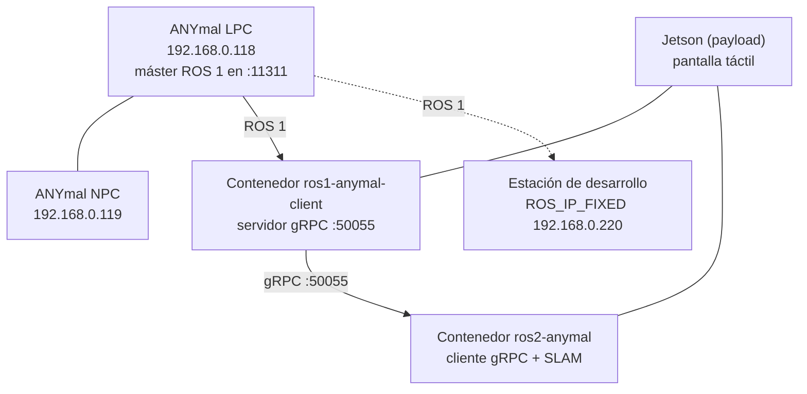

<Callout type="warn" title="Contenido sensible para publicación">
Esta página incluye direcciones IP de la red del laboratorio. Están tomadas de los README de los
propios repositorios del equipo. Si el portal se despliega en una URL pública, revisa antes si
esta página debe quedar restringida.
</Callout>

## Topología



Alias de host que configuran los scripts: `anymal-d092-lpc` y `anymal-d092-npc`. El identificador
del robot del laboratorio es, por tanto, **d092**.

## Direcciones

| Nombre | Valor por defecto | Qué es |
| --- | --- | --- |
| `ANYMAL_LPC_IP` / `ANYMAL_IP` | `192.168.0.118` | LPC del robot; ahí corre el máster ROS 1 |
| `ANYMAL_NPC_IP` | `192.168.0.119` | NPC del robot |
| `ROS_IP_FIXED` | `192.168.0.220` | Máquina cliente, alcanzable desde la red del robot |
| `GRPC_PORT` | `50055` | Puerto del stream gRPC |
| Máster ROS 1 | `<lpc-ip>:11311` | Puerto estándar de `roscore` |

Son los valores de ejemplo de los repositorios; hay que ajustarlos a la red real de cada
despliegue.

## ROS 1: conectividad bidireccional

ROS 1 exige que el máster pueda contactar a los nodos **y** que los nodos puedan contactar al
máster entre sí. Variables que hay que fijar bien:

| Variable | Para qué |
| --- | --- |
| `ROS_MASTER_URI` | Dirección del máster que usa la shell actual |
| `ROS_IP` | IP que este cliente anuncia a los demás nodos |
| `ROS_HOSTNAME` | Alternativa por nombre de host; **no la mezcles con `ROS_IP`** |

El contenedor del cliente ROS 1 usa red de host (`--network host`) precisamente para que esta
conectividad bidireccional funcione.

Verificación desde dentro del contenedor:

```bash
ros_anymal
echo "$ROS_MASTER_URI"
echo "$ROS_IP"
rostopic list
```

## ROS 2: dominio DDS

El contenedor de la app y el contenedor `ros2-anymal` deben compartir el mismo
`ROS_DOMAIN_ID`; si no, la app no ve los tópicos que publica el cliente gRPC.

El workspace `ros2Anymal_ws` del repositorio de entrenamiento incluye además un `fastdds.xml`
propio, para ajustar el transporte de Fast DDS. Falta documentar qué cambia exactamente respecto
a los valores por defecto.

## Comprobación de salud de la cadena

La app de operación vigila los tres eslabones de forma continua:

| Eslabón | Cómo se comprueba | Verde cuando |
| --- | --- | --- |
| ANYmal | `ping -c1 -W1 $ANYMAL_IP` | El robot responde |
| Puente ROS 1 | conexión TCP a `127.0.0.1:50055` | El servidor gRPC acepta conexiones |
| Puente ROS 2 | frescura de los tópicos | `/scan` y `/odom` llegaron hace menos de 3 s |

Si un eslabón falla, la app reintenta automáticamente cada 3 segundos, con un tope de 5 intentos.
El eslabón del ANYmal no se reintenta con procesos: un ping perdido es un fallo de red o del
robot, no de un proceso que se pueda relanzar.
