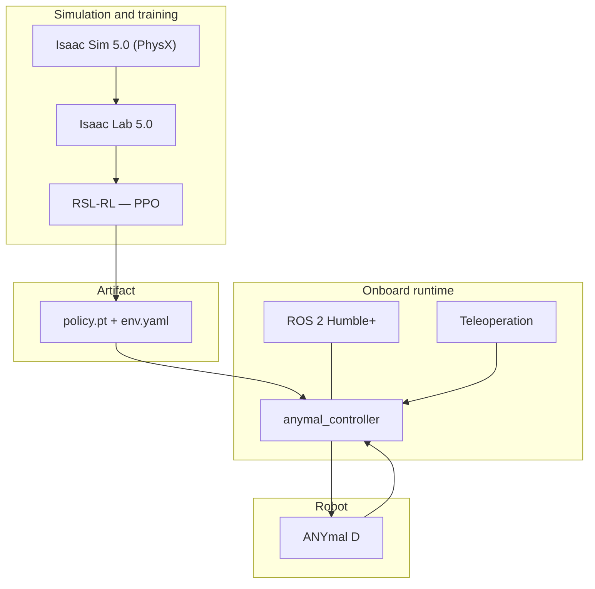

## Layers



## Confirmed stack

From the README and the file tree of `Anymal-Research`:

| Layer | Technology | Declared version |
| --- | --- | --- |
| Simulation | NVIDIA Isaac Sim | 5.0.0 |
| RL environment | NVIDIA Isaac Lab | 5.0.0 |
| Algorithm | RSL-RL (PPO) | — |
| Learning | PyTorch | 2.3.0+ |
| CUDA | — | 12.1+ |
| Middleware | ROS 2 | Humble or newer |
| Language | Python | 3.10 – 3.11 |
| OS | Ubuntu | 22.04+ |

The DDS middleware is configured through a `fastdds.xml` at the root of the ROS 2 workspace,
which indicates the team tunes Fast DDS transport rather than using stock settings. Details of
that configuration are in [communication](/en/docs/05-software/communication).

## Training repository structure

```
Anymal-Research/
├── anymal-d-managerbased/anymalDTraining/
│   ├── scripts/                 # list_envs, random_agent, zero_agent
│   │   └── rsl_rl/              # train.py, play.py, cli_args.py
│   └── source/anymalDTraining/
│       └── .../anymaldtraining/
│           ├── anymaldtraining_env_cfg.py   # environment configuration
│           ├── agents/rsl_rl_ppo_cfg.py     # PPO hyperparameters
│           └── mdp/                          # rewards, terminations, curriculums, symmetry
└── ros2Anymal_ws/
    ├── fastdds.xml
    └── src/anymal_controller_policy/anymal_controller/
        ├── policy/{policy.pt, env.yaml}
        ├── scripts/anymal_teleop.py
        └── launch/anymal_teleop.launch.py
```

## Layers to be confirmed

SLAM, vision and the ROS 1 client live in private repositories. Their pages
([SLAM](/en/docs/05-software/slam), [vision](/en/docs/05-software/vision),
[communication](/en/docs/05-software/communication)) are marked as pending.
