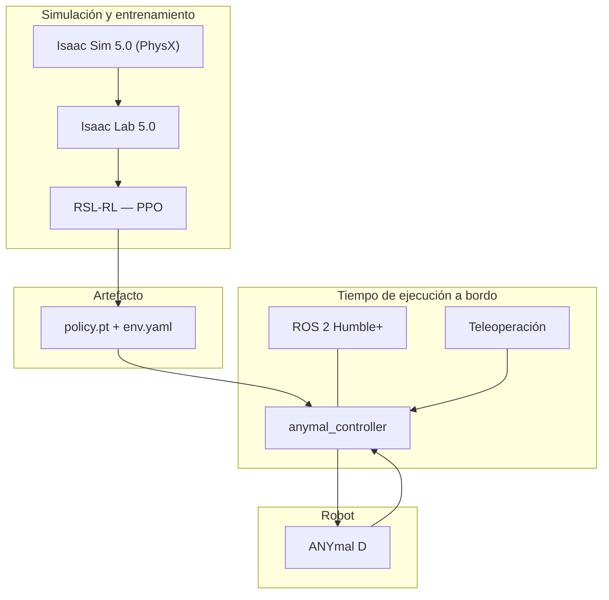

## Capas



## Stack confirmado

Del README y del árbol de `Anymal-Research`:

| Capa | Tecnología | Versión declarada |
| --- | --- | --- |
| Simulación | NVIDIA Isaac Sim | 5.0.0 |
| Entorno de RL | NVIDIA Isaac Lab | 5.0.0 |
| Algoritmo | RSL-RL (PPO) | — |
| Aprendizaje | PyTorch | 2.3.0+ |
| CUDA | — | 12.1+ |
| Middleware | ROS 2 | Humble o superior |
| Lenguaje | Python | 3.10 – 3.11 |
| Sistema | Ubuntu | 22.04+ |

El middleware DDS se configura con un `fastdds.xml` en la raíz del workspace ROS 2, lo que
indica que el equipo ajusta el transporte de Fast DDS en lugar de usar el de fábrica. Los
detalles de esa configuración están en [comunicación](/es/docs/05-software/communication).

## Estructura del repositorio de entrenamiento

```
Anymal-Research/
├── anymal-d-managerbased/anymalDTraining/
│   ├── scripts/                 # list_envs, random_agent, zero_agent
│   │   └── rsl_rl/              # train.py, play.py, cli_args.py
│   └── source/anymalDTraining/
│       └── .../anymaldtraining/
│           ├── anymaldtraining_env_cfg.py   # configuración del entorno
│           ├── agents/rsl_rl_ppo_cfg.py     # hiperparámetros de PPO
│           └── mdp/                          # rewards, terminations, curriculums, symmetry
└── ros2Anymal_ws/
    ├── fastdds.xml
    └── src/anymal_controller_policy/anymal_controller/
        ├── policy/{policy.pt, env.yaml}
        ├── scripts/anymal_teleop.py
        └── launch/anymal_teleop.launch.py
```

## Capas por confirmar

SLAM, visión y el cliente ROS 1 viven en repositorios privados. Sus páginas
([SLAM](/es/docs/05-software/slam), [visión](/es/docs/05-software/vision),
[comunicación](/es/docs/05-software/communication)) están marcadas como pendientes.
