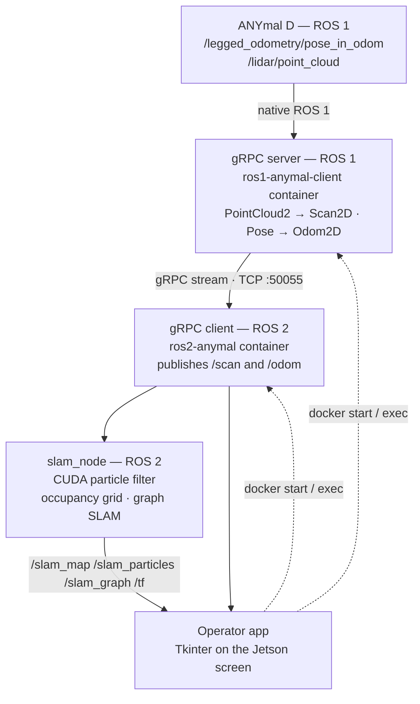
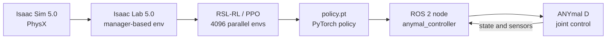
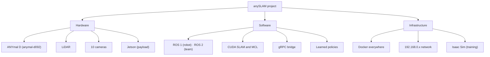
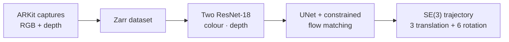

The system has two flows that currently run separately: the **operation and SLAM chain**, which
goes from the robot to the Jetson, and the **learning chain**, which goes from simulation to the
robot.

## The operation and SLAM chain

This is the project's main path, and it is complete end to end.

The gRPC bridge exists because the ANYmal's native software speaks **ROS 1** while all new team
development is **ROS 2**. Instead of using `ros1_bridge`, the team streams only what SLAM needs
— planar odometry and a 2D scan — over a gRPC stream, in two custom messages (`Odom2D` and
`Scan2D`). See [communication](/en/docs/05-software/communication).

All three components run in **Docker containers on a Jetson** mounted as the robot's payload.
The Tkinter app is not just a UI: it is the orchestrator that starts the containers and watches
that all three links stay alive.

## The learning chain

Details in [learned policies](/en/docs/05-software/learning).

<Callout title="The two flows do not meet yet">
SLAM produces a map and a pose; the learned policy consumes velocity commands. We have found no
code connecting the SLAM output to the controller input. If that integration exists or is
planned, it deserves documenting here.
</Callout>

## The three layers

## A third line: trajectory generation

[`FLOWMAS-ANYmal`](https://github.com/carloAdr1/FLOWMAS-ANYmal) continues the
[work presented at ICRA 2025](/en/docs/09-research/papers): it generates trajectories with *flow
matching* from RGB + depth captures.

<Callout title="It is not wired to the robot">
The code **never mentions the ANYmal**: it is platform-agnostic, and its stated goal is for the
training to transfer to other robots. There is also no code connecting it to SLAM or to the
locomotion controller.

That is why it is documented as a third research line, running alongside the operation and
learning chains, rather than as part of the stack running on the robot today. If it has already
been run on the ANYmal, that needs saying here.
</Callout>

The detail is in [vision and perception](/en/docs/05-software/vision).

## Related documents

- [Hardware architecture](/en/docs/02-architecture/hardware-architecture)
- [Software architecture](/en/docs/02-architecture/software-architecture)
- [Network architecture](/en/docs/02-architecture/network-architecture)
- [Data flow](/en/docs/02-architecture/data-flow)
