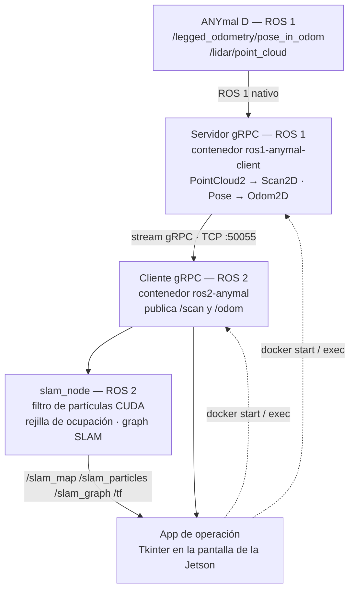
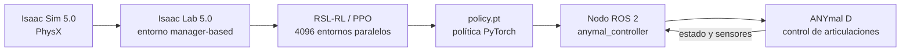
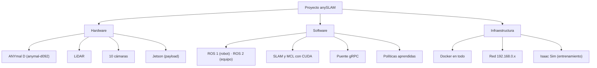

El sistema tiene dos flujos que hoy corren por separado: la **cadena de operación y SLAM**, que
va del robot a la Jetson, y la **cadena de aprendizaje**, que va de la simulación al robot.

## La cadena de operación y SLAM

Es el camino principal del proyecto, y está completo de punta a punta.

El puente gRPC existe porque el software nativo del ANYmal habla **ROS 1** y todo el desarrollo
nuevo del equipo es **ROS 2**. En lugar de usar `ros1_bridge`, el equipo transmite únicamente lo
que el SLAM necesita —odometría planar y escaneo 2D— por un stream gRPC, en dos mensajes propios
(`Odom2D` y `Scan2D`). Ver [comunicación](/es/docs/05-software/communication).

Los tres componentes corren en **contenedores Docker sobre una Jetson** montada como payload del
robot. La app de Tkinter no es solo una interfaz: es el orquestador que arranca los contenedores
y vigila que los tres eslabones estén vivos.

## La cadena de aprendizaje

Detalles en [políticas aprendidas](/es/docs/05-software/learning).

<Callout title="Los dos flujos aún no se tocan">
El SLAM produce mapa y pose; la política aprendida consume comandos de velocidad. No hemos
encontrado código que conecte la salida del SLAM con la entrada del controlador. Si la
integración existe o está planeada, merece documentarse aquí.
</Callout>

## Las tres capas

## Una nota sobre FLOWMAS

El [trabajo presentado en ICRA 2025](/es/docs/09-research/papers) describe una arquitectura de
*flow matching* para navegación. Su experimento de despliegue planeado usa un **shuttle
EG6088K** con un Velodyne HDL-32 y una cámara MultiSense S21 — **no el ANYmal**.

`FLOWMAS` es el único repositorio del proyecto al que no hemos podido acceder, así que esta
línea se documenta como investigación de navegación *adyacente*, no como parte de la pila del
robot. Si en realidad convergen, hay que decirlo aquí explícitamente.

## Documentos relacionados

- [Arquitectura de hardware](/es/docs/02-architecture/hardware-architecture)
- [Arquitectura de software](/es/docs/02-architecture/software-architecture)
- [Arquitectura de red](/es/docs/02-architecture/network-architecture)
- [Flujo de datos](/es/docs/02-architecture/data-flow)
