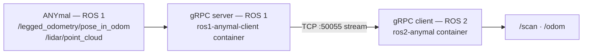

## Why there is a bridge

The ANYmal's native software speaks **ROS 1**. All new team development is **ROS 2**. Instead of
using `ros1_bridge`, the team streams over **gRPC** only what SLAM needs: planar odometry and a
2D scan.



The conversion the server performs:

| From the ANYmal (ROS 1) | Becomes | gRPC message |
| --- | --- | --- |
| `/lidar/point_cloud` (`PointCloud2`) | 2D scan | `Scan2D` |
| `/legged_odometry/pose_in_odom` (pose) | planar odometry | `Odom2D` |

Reducing the 3D cloud to a 2D scan is a design decision with consequences: the project's SLAM is
planar (SE(2)), not 3D.

## The gRPC contract

Defined in `grpc_anymal_bridge/proto/anymal_bridge.proto`:

```proto
service AnymalSensorBridge {
  rpc StreamSensors(SensorRequest) returns (stream SensorPacket);
}

message SensorRequest { double rate_hz = 1; }

message SensorPacket {
  Odom2D odom  = 1;
  Scan2D scan  = 2;
  Scan2D scan2 = 3;   // second LiDAR, optional
}

message Odom2D {
  double x = 1; double y = 2; double theta = 3;
  double vx = 4; double vy = 5; double vtheta = 6;
  double stamp_sec = 7;
}

message Scan2D {
  repeated float ranges = 1;
  float angle_min = 2; float angle_max = 3; float angle_increment = 4;
  float range_min = 5; float range_max = 6;
  string frame_id = 7; double stamp_sec = 8;
}
```

The client requests a rate (`rate_hz`) and the server opens a stream. `SensorPacket` carries
**two scans**, suggesting support for a second LiDAR.

If you change the `.proto`, the stubs must be regenerated with `regenerate_grpc.sh` **in both
repositories**: server and client share the contract.

## Interface table

### ROS 2 topics

| Topic | Type | Publisher | Consumer |
| --- | --- | --- | --- |
| `/odom` | `nav_msgs/Odometry` | gRPC client | `slam_node`, app |
| `/scan` | `sensor_msgs/LaserScan` | gRPC client | `slam_node`, app |
| `/slam_map` | `nav_msgs/OccupancyGrid` | `slam_node` | RViz, app |
| `/slam_particles` | `geometry_msgs/PoseArray` | `slam_node` | RViz |
| `/slam_graph` | `visualization_msgs/MarkerArray` | `slam_node` | RViz |
| `/mcl_pose` | pose | `slam_node` in MCL mode | app |
| `/tf` | `tf2_msgs/TFMessage` | `slam_node` publishes `map → odom` | everyone |

### Cameras (ROS)

The ten cameras the robot exposes, per `ros_bridge.py` in the operator app:

| Camera | Topic |
| --- | --- |
| Front (teleoperation) | `/wide_angle_camera_front/image_raw` |
| Rear (teleoperation) | `/wide_angle_camera_rear/image_raw` |
| 20x zoom | `/ptz_camera/image_raw` |
| Thermal | `/thermal_camera/image_raw` |
| Depth 1 – 6 | `/depth_camera_1..6/image_raw` |

### ROS 2 services

| Service | Type | Description |
| --- | --- | --- |
| `PlanPath` | `robot_interfaces/srv/PlanPath` | Takes a goal, returns a `nav_msgs/Path` |

### Network interfaces

| Interface | Value | Notes |
| --- | --- | --- |
| gRPC port | `50055` | Configurable via `GRPC_PORT` |
| ROS 1 master | `<lpc-ip>:11311` | On the robot's LPC |
| Docker | `docker exec` from the app | Starts the bridge processes |

## The robot's ROS 1 interfaces

The `ros1-anymal-client` repository ships `anymal_interfaces`, a broad set of ANYmal message,
service and action definitions: fault propagation (`acl_fault_propagation_ros_msgs`), lifecycle
state machine (`acl_lcsm_ros_msgs`), time types (`acl_time_ros1_msgs`), acoustic inspection
(`acoustic_imaging_msgs`) and more.

That allows calling the robot's services and actions from Python without installing the full
ANYbotics stack. It also includes **control-lease management**, which is what authorises a client
to send commands to the robot.

## Rule

> A change to a public interface — the `.proto`, a topic, a service — requires updating this
> page **in the same Pull Request**.
