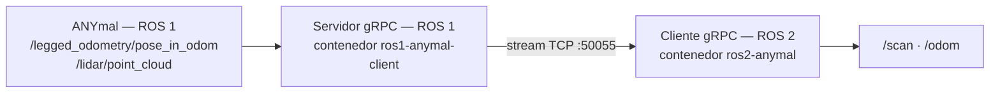

## Por qué hay un puente

El software nativo del ANYmal habla **ROS 1**. Todo el desarrollo nuevo del equipo es **ROS 2**.
En lugar de usar `ros1_bridge`, el equipo transmite por **gRPC** solo lo que el SLAM necesita:
odometría planar y un escaneo 2D.



La conversión que hace el servidor:

| Del ANYmal (ROS 1) | Se convierte en | Mensaje gRPC |
| --- | --- | --- |
| `/lidar/point_cloud` (`PointCloud2`) | escaneo 2D | `Scan2D` |
| `/legged_odometry/pose_in_odom` (pose) | odometría planar | `Odom2D` |

Reducir la nube 3D a un escaneo 2D es una decisión de diseño con consecuencias: el SLAM del
proyecto es planar (SE(2)), no 3D.

## El contrato gRPC

Definido en `grpc_anymal_bridge/proto/anymal_bridge.proto`:

```proto
service AnymalSensorBridge {
  rpc StreamSensors(SensorRequest) returns (stream SensorPacket);
}

message SensorRequest { double rate_hz = 1; }

message SensorPacket {
  Odom2D odom  = 1;
  Scan2D scan  = 2;
  Scan2D scan2 = 3;   // segundo LiDAR, opcional
}

message Odom2D {
  double x = 1; double y = 2; double theta = 3;
  double vx = 4; double vy = 5; double vtheta = 6;
  double stamp_sec = 7;
}

message Scan2D {
  repeated float ranges = 1;
  float angle_min = 2; float angle_max = 3; float angle_increment = 4;
  float range_min = 5; float range_max = 6;
  string frame_id = 7; double stamp_sec = 8;
}
```

El cliente pide una frecuencia (`rate_hz`) y el servidor abre un stream. `SensorPacket` admite
**dos escaneos**, lo que sugiere soporte para un segundo LiDAR.

Si cambias el `.proto`, hay que regenerar los stubs con `regenerate_grpc.sh` **en los dos
repositorios**: el servidor y el cliente comparten el contrato.

## Tabla de interfaces

### Tópicos ROS 2

| Tópico | Tipo | Quién publica | Quién consume |
| --- | --- | --- | --- |
| `/odom` | `nav_msgs/Odometry` | cliente gRPC | `slam_node`, app |
| `/scan` | `sensor_msgs/LaserScan` | cliente gRPC | `slam_node`, app |
| `/slam_map` | `nav_msgs/OccupancyGrid` | `slam_node` | RViz, app |
| `/slam_particles` | `geometry_msgs/PoseArray` | `slam_node` | RViz |
| `/slam_graph` | `visualization_msgs/MarkerArray` | `slam_node` | RViz |
| `/mcl_pose` | pose | `slam_node` en modo MCL | app |
| `/tf` | `tf2_msgs/TFMessage` | `slam_node` publica `map → odom` | todos |

### Cámaras (ROS)

Las diez cámaras que expone el robot, según `ros_bridge.py` de la app de operación:

| Cámara | Tópico |
| --- | --- |
| Frontal (teleoperación) | `/wide_angle_camera_front/image_raw` |
| Trasera (teleoperación) | `/wide_angle_camera_rear/image_raw` |
| Zoom 20x | `/ptz_camera/image_raw` |
| Térmica | `/thermal_camera/image_raw` |
| Profundidad 1 – 6 | `/depth_camera_1..6/image_raw` |

### Servicios ROS 2

| Servicio | Tipo | Descripción |
| --- | --- | --- |
| `PlanPath` | `robot_interfaces/srv/PlanPath` | Recibe una meta, devuelve un `nav_msgs/Path` |

### Interfaces de red

| Interfaz | Valor | Notas |
| --- | --- | --- |
| Puerto gRPC | `50055` | Configurable con `GRPC_PORT` |
| Máster ROS 1 | `<lpc-ip>:11311` | En la LPC del robot |
| Docker | `docker exec` desde la app | Arranque de los procesos puente |

## Interfaces ROS 1 del robot

El repositorio `ros1-anymal-client` incluye `anymal_interfaces`, un conjunto amplio de
definiciones de mensajes, servicios y acciones del ANYmal: propagación de fallos
(`acl_fault_propagation_ros_msgs`), máquina de estados de ciclo de vida (`acl_lcsm_ros_msgs`),
tipos de tiempo (`acl_time_ros1_msgs`), inspección acústica (`acoustic_imaging_msgs`) y más.

Eso permite llamar a servicios y acciones del robot desde Python sin instalar la pila completa
de ANYbotics. Incluye también la **gestión del lease de control**, que es lo que autoriza a un
cliente a mandar comandos al robot.

## Regla

> Un cambio en una interfaz pública —el `.proto`, un tópico, un servicio— obliga a actualizar
> esta página **en el mismo Pull Request**.
