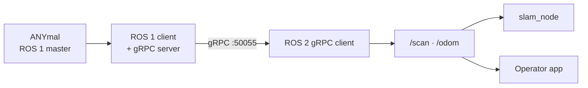

The ANYmal speaks **ROS 1**. The team develops in **ROS 2**. The two coexist through a custom
gRPC bridge.

## ROS 1 — the robot side

The ANYmal's native software exposes its interface in ROS 1, with the master running on the
robot's LPC (`<lpc-ip>:11311`).

The `ros1-anymal-client` repository provides a **Docker client environment** for talking to that
master without installing the full ANYbotics stack on the development machine. It allows:

- Reading topics published by the robot or the simulation.
- Calling ANYmal services and actions from Python.
- Using the robot's message definitions (`anymal_interfaces`).
- **Acquiring and holding the control lease**, which is what authorises sending commands.
- Keyboard teleoperation.
- Recording and replaying rosbags for SLAM experiments.
- Running the gRPC server that feeds the ROS 2 side.

<Callout title="It does not start the robot">
The ROS 1 client is only a client: it does not bring up the ANYmal stack, the simulation, the
master, or the safety system. Those services must already be running on the robot.
</Callout>

## ROS 2 — the team side

| Component | Repository | Distribution |
| --- | --- | --- |
| `slam_node`, gRPC client | `ros2-anymal-slam` | Dashing, Foxy, Humble or Jazzy (detected) |
| `anymal_controller` | `Anymal-Research` | Humble or newer |
| Operator app | `ANYmal_data_management` | ROS 2 on the Jetson host |

## The bridge

**Why gRPC and not `ros1_bridge`.** The official bridge requires compiling every message
definition on both sides and keeping distributions compatible. The team chose to stream only what
SLAM needs — planar odometry and a 2D scan — using two custom messages and a rate-configurable
stream. The full contract is in [communication](/en/docs/05-software/communication).

The trade-off is that the bridge only carries what is in the `.proto`. Adding new data — the
cameras, for example — requires changing the contract and regenerating the stubs in both
repositories.

## Conventions

| Convention | Status |
| --- | --- |
| `ROS_MASTER_URI` / `ROS_IP` variables in ROS 1 | Documented in the client repository |
| `ROS_DOMAIN_ID` shared between app and ROS 2 container | Known requirement, no formal assignment |
| `tf` frames: `map → odom → base_link` | Confirmed |
| Topic naming | No written convention |
