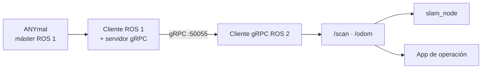

El ANYmal habla **ROS 1**. El equipo desarrolla en **ROS 2**. Ambos conviven mediante un puente
gRPC propio.

## ROS 1 — el lado del robot

El software nativo del ANYmal expone su interfaz en ROS 1, con el máster corriendo en la LPC del
robot (`<lpc-ip>:11311`).

El repositorio `ros1-anymal-client` proporciona un **entorno cliente en Docker** para hablar con
ese máster sin instalar la pila completa de ANYbotics en la máquina de desarrollo. Lo que
permite:

- Leer los tópicos que publica el robot o la simulación.
- Llamar a servicios y acciones del ANYmal desde Python.
- Usar las definiciones de mensajes del robot (`anymal_interfaces`).
- **Adquirir y mantener el lease de control**, que es lo que autoriza a mandar comandos.
- Teleoperación por teclado.
- Grabar y reproducir rosbags para experimentos de SLAM.
- Correr el servidor gRPC que alimenta al lado ROS 2.

<Callout title="No arranca el robot">
El cliente ROS 1 es solo un cliente: no levanta la pila del ANYmal, ni la simulación, ni el
máster, ni el sistema de seguridad. Esos servicios ya deben estar corriendo en el robot.
</Callout>

## ROS 2 — el lado del equipo

| Componente | Repositorio | Distribución |
| --- | --- | --- |
| `slam_node`, cliente gRPC | `ros2-anymal-slam` | Dashing, Foxy, Humble o Jazzy (se detecta) |
| `anymal_controller` | `Anymal-Research` | Humble o superior |
| App de operación | `ANYmal_data_management` | ROS 2 en el host de la Jetson |

## El puente

**Por qué gRPC y no `ros1_bridge`.** El puente oficial obliga a compilar todas las definiciones
de mensajes en ambos lados y a mantener compatibilidad entre distribuciones. El equipo optó por
transmitir solo lo que el SLAM necesita —odometría planar y escaneo 2D— con dos mensajes propios
y un stream de tasa configurable. El contrato completo está en
[comunicación](/es/docs/05-software/communication).

La contrapartida es que el puente solo transmite lo que está en el `.proto`. Añadir un dato nuevo
—las cámaras, por ejemplo— requiere modificar el contrato y regenerar los stubs en ambos
repositorios.

## Convenciones

| Convención | Estado |
| --- | --- |
| Variables `ROS_MASTER_URI` / `ROS_IP` en ROS 1 | Documentadas en el repositorio del cliente |
| `ROS_DOMAIN_ID` compartido entre app y contenedor ROS 2 | Requisito conocido, sin asignación formal |
| Marcos `tf`: `map → odom → base_link` | Confirmado |
| Nombres de tópicos | Sin convención escrita |
