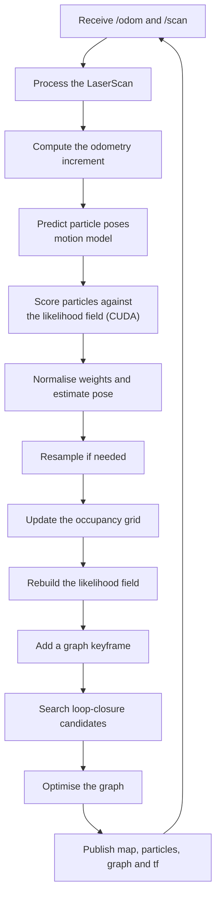

| | |
| --- | --- |
| **Repository** | [`ros2-anymal-slam`](https://github.com/Alponcho6594/ros2-anymal-slam) (private) |
| **Maintainer** | [@Alponcho6594](https://github.com/Alponcho6594) |
| **Status** | Active |

A 2D SLAM and Monte Carlo Localization framework on ROS 2, accelerated with CUDA. It is written
in C++ with CUDA kernels and runs in Docker containers on both Jetson and desktop.

## What it implements

| Component | File | What it does |
| --- | --- | --- |
| CUDA particle filter | `particle_filter_cuda.cpp`, `cuda_kernels.cu` | GPU particle prediction and scoring |
| Monte Carlo Localization | `montecarlo_localization.cpp` | MCL against a known map |
| Occupancy grid | `occupancy_grid_map.cpp` | Mapping with log-odds updates |
| Likelihood field | `likelihood_field.cpp` | Scan evaluation against the map |
| Graph SLAM | `graph_slam.cpp` | Keyframes, loop closure and graph correction |
| Motion models | `motion_model.cpp` | SE(2) for several platform types |
| Scan processing | `scan_processor.cpp` | `LaserScan` preparation |
| State machine | `slam_state_machine.cpp` | Coordinates the SLAM cycle |
| Map management | `map_manager.cpp` | Per-experiment map loading and saving |

ROS 2 packages: `robot_navigation` (the nodes) and `robot_interfaces` (the `PlanPath` service).

## The SLAM cycle



## Topics

### Input

| Topic | Type | Purpose |
| --- | --- | --- |
| `/odom` | `nav_msgs/Odometry` | Planar odometry for the motion model |
| `/scan` | `sensor_msgs/LaserScan` | 2D range measurements for SLAM or MCL |

Both are published by the gRPC client, not directly by the robot. See
[communication](/en/docs/05-software/communication).

### SLAM-mode output

| Topic | Type | Purpose |
| --- | --- | --- |
| `/slam_map` | `nav_msgs/OccupancyGrid` | Current occupancy map |
| `/slam_particles` | `geometry_msgs/PoseArray` | Particle-filter visualisation |
| `/slam_graph` | `visualization_msgs/MarkerArray` | Graph keyframes and edges |
| `/tf`, `/tf_static` | `tf2_msgs/TFMessage` | Transforms; SLAM publishes `map → odom` |

### Localisation-mode output

`/static_map`, `/mcl_pose`, `/mcl_particles`, `/tf`, `/tf_static`.

## Planning service

```
# robot_interfaces/srv/PlanPath.srv
geometry_msgs/PoseStamped goal
---
bool success
string message
nav_msgs/Path path
```

## Platforms

The repository is not tied to one specific version: its scripts detect the platform and pick a
compatible environment.

| Detects | Supported options |
| --- | --- |
| Platform | Jetson (JetPack 4, 5, 6) or desktop Ubuntu |
| ROS 2 | Dashing, Foxy, Humble or Jazzy |
| CUDA | Docker image and compute capability per host |

## Maps and experiments

Maps are saved per experiment with a prefix (`exp1.pgm` / `exp1.yaml`, `exp2.*`, …). The
repository ships recorded maps: `map.pgm`, `map30.pgm` and `map54.pgm` with their `.yaml`, plus
`map_pixel_editor.py` for editing them.

There are recording and replay scripts (`record_ros2_exp.sh`, `play_ros2_exp.sh`) using ROS 2
bags, to repeat an experiment without the robot.

## How it is run

Everything goes through Docker:

```bash
./build.sh      # builds the image, detecting platform and CUDA
./run.sh        # creates and starts the container
./shell.sh      # enters an already-created container
./run_slam.sh   # launches slam_node with an experiment prefix
```

Included RViz 2 configurations: `rviz/slam_mcl.rviz` and `rviz/path.rviz`.

<Callout title="Full detail lives in the repository">
The `ros2-anymal-slam` README runs to over 2500 lines, covering the theory of each component
(MCL, motion models, log-odds, likelihood field, graph SLAM), the parameters, and a
troubleshooting section. This page is the summary; the detail lives there.
</Callout>

## Still to document

- Parameters used in normal operation (particle count, map resolution).
- Accuracy measured in lab experiments.
- Repository licence.
- Whether the SLAM output connects to the locomotion controller.
