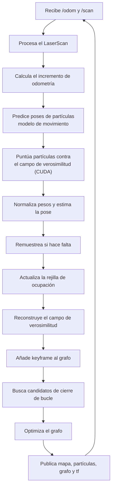

**Repositorio:** [`ros2-anymal-slam`](https://github.com/Alponcho6594/ros2-anymal-slam) (privado)
· **Responsable:** [@Alponcho6594](https://github.com/Alponcho6594) · **Estado:** activo

Framework de SLAM 2D y localización Monte Carlo sobre ROS 2, acelerado con CUDA. Está escrito en
C++ con kernels CUDA, y se ejecuta en contenedores Docker tanto en Jetson como en escritorio.

## Qué implementa

| Componente | Archivo | Qué hace |
| --- | --- | --- |
| Filtro de partículas CUDA | `particle_filter_cuda.cpp`, `cuda_kernels.cu` | Predicción y puntuación de partículas en GPU |
| Localización Monte Carlo | `montecarlo_localization.cpp` | MCL sobre un mapa conocido |
| Rejilla de ocupación | `occupancy_grid_map.cpp` | Mapeo con actualización log-odds |
| Campo de verosimilitud | `likelihood_field.cpp` | Evaluación de escaneos contra el mapa |
| Graph SLAM | `graph_slam.cpp` | Keyframes, cierre de bucle y corrección del grafo |
| Modelos de movimiento | `motion_model.cpp` | SE(2) para distintos tipos de plataforma |
| Procesamiento de escaneo | `scan_processor.cpp` | Preparación del `LaserScan` |
| Máquina de estados | `slam_state_machine.cpp` | Coordina el ciclo de SLAM |
| Gestión de mapas | `map_manager.cpp` | Carga y guardado de mapas por experimento |

Paquetes ROS 2: `robot_navigation` (los nodos) y `robot_interfaces` (el servicio `PlanPath`).

## El ciclo de SLAM



## Tópicos

### Entrada

| Tópico | Tipo | Para qué |
| --- | --- | --- |
| `/odom` | `nav_msgs/Odometry` | Odometría planar para el modelo de movimiento |
| `/scan` | `sensor_msgs/LaserScan` | Medidas 2D de rango para SLAM o MCL |

Ambos los publica el cliente gRPC, no el robot directamente. Ver
[comunicación](/es/docs/05-software/communication).

### Salida en modo SLAM

| Tópico | Tipo | Para qué |
| --- | --- | --- |
| `/slam_map` | `nav_msgs/OccupancyGrid` | Mapa de ocupación actual |
| `/slam_particles` | `geometry_msgs/PoseArray` | Visualización del filtro de partículas |
| `/slam_graph` | `visualization_msgs/MarkerArray` | Keyframes y aristas del grafo |
| `/tf`, `/tf_static` | `tf2_msgs/TFMessage` | Transformadas; el SLAM publica `map → odom` |

### Salida en modo localización

`/static_map`, `/mcl_pose`, `/mcl_particles`, `/tf`, `/tf_static`.

## Servicio de planeación

```
# robot_interfaces/srv/PlanPath.srv
geometry_msgs/PoseStamped goal
---
bool success
string message
nav_msgs/Path path
```

## Plataformas

El repositorio no está atado a una versión concreta: sus scripts detectan la plataforma y eligen
el entorno compatible.

| Detecta | Opciones soportadas |
| --- | --- |
| Plataforma | Jetson (JetPack 4, 5, 6) o escritorio Ubuntu |
| ROS 2 | Dashing, Foxy, Humble o Jazzy |
| CUDA | Imagen Docker y capacidad de cómputo según el host |

## Mapas y experimentos

Los mapas se guardan por experimento con un prefijo (`exp1.pgm` / `exp1.yaml`, `exp2.*`, …). El
repositorio incluye mapas ya grabados: `map.pgm`, `map30.pgm` y `map54.pgm`, con sus `.yaml`, más
`map_pixel_editor.py` para editarlos.

Hay scripts de grabación y reproducción (`record_ros2_exp.sh`, `play_ros2_exp.sh`) que usan bags
de ROS 2, para repetir un experimento sin el robot.

## Cómo se ejecuta

Todo pasa por Docker:

```bash
./build.sh      # construye la imagen, detectando plataforma y CUDA
./run.sh        # crea y arranca el contenedor
./shell.sh      # entra a un contenedor ya creado
./run_slam.sh   # lanza el slam_node con un prefijo de experimento
```

Configuraciones de RViz 2 incluidas: `rviz/slam_mcl.rviz` y `rviz/path.rviz`.

<Callout title="Detalle completo en el repositorio">
El README de `ros2-anymal-slam` tiene más de 2500 líneas, con la teoría de cada componente
(MCL, modelos de movimiento, log-odds, campo de verosimilitud, graph SLAM), los parámetros y una
sección de resolución de problemas. Esta página es el resumen; el detalle vive allí.
</Callout>

## Lo que falta documentar

- Parámetros con los que se opera normalmente (número de partículas, resolución del mapa).
- Precisión medida en los experimentos del laboratorio.
- Licencia del repositorio.
- Si la salida del SLAM se conecta con el controlador de locomoción.
