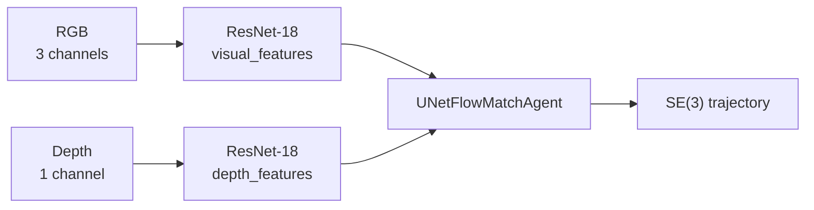

The project uses imagery on two very different fronts: **operation** (teleoperation and
inspection from the robot) and **trajectory learning** (a generative model trained on RGB + depth
captures).

## Operation

The ANYmal exposes [ten cameras](/en/docs/04-hardware/cameras) as ROS topics: two wide-angle, a
PTZ with 20x zoom, a thermal one, and six depth cameras. They are consumed from the Jetson app
for teleoperation and inspection.

<Callout title="No camera feeds SLAM">
The project's SLAM is purely LiDAR-based: the gRPC bridge only streams odometry and a 2D scan.
See [communication](/en/docs/05-software/communication).
</Callout>

## Trajectory generation — FLOWMAS-ANYmal

**Repository:** [`FLOWMAS-ANYmal`](https://github.com/carloAdr1/FLOWMAS-ANYmal) (private)

A continuation of the [ICRA 2025 work](/en/docs/09-research/papers). The package is named
`trajectory` and trains a *flow matching* model that predicts trajectories from visual
observations.

### Inputs

The two modalities are encoded **separately**, by two distinct ResNet-18s: the depth one is
configured with `input_channels: 1` and group normalisation. Neither does average pooling, so the
model receives all image tokens.

This differs from the ICRA poster, which concatenated RGB with a Scan Context++-style point-cloud
descriptor. Here the second modality is dense depth, not a sparse cloud.

### Output

| Parameter | Value |
| --- | --- |
| `action_dim` | 9 — 3 translation + 6 rotation, i.e. SE(3) |
| `pred_horizon` | 8 steps (10 with SCAND) |
| `obs_horizon` | 2 steps |
| `action_horizon` | 8 steps |

Predicting full 6D rotation is what makes it possible to analyse the motion the robot chooses to
take, not just its planar displacement.

### Model

| Parameter | Value |
| --- | --- |
| Architecture | `UNetFlowMatchAgent` (transformer and spatial-memory variants also exist) |
| `embed_dim` | 512 |
| Flow steps | 50 in training, 100 in evaluation |
| `sigma` | 0.1 |
| Dropout | 0.3 |
| EMA | enabled, decay 0.999 |
| Constrained flow matching | yes, `constraint_strength` 0.8 |

`flowmatch/ecat_unet.py` implements the UNet with efficient channel attention (ECA), the one
described in the poster.

### Training

| Parameter | Value |
| --- | --- |
| Batch | 256 |
| Epochs | 51 |
| Learning rate | 1e-4, with 500 warmup steps |
| Weight decay | 1e-6 |

Configured with Hydra; datasets are stored in **Zarr**, and `utils/arkit_to_zarr.py` converts
ARKit captures into that format.

### Supported datasets

| Config | Status |
| --- | --- |
| `arkit` | Default for the training task. Loads `rgb`, `depth`, `poses` and `actions` |
| `pusht` | Validation environment, the same as in the poster |
| `scand` | **Config present, implementation missing**: it targets `flowmatch.scand.SCANDDataset`, which is not in the repository |

### Notable dependencies

`torchcfm` (conditional flow matching), `torchdyn` (neural ODE solvers), `pot` (optimal
transport, reference 6 in the poster), `diffusers`, `zarr`, `gym-pusht`, and `rerun-sdk` for
visualisation. Python 3.11.

## What is missing

- Has it been run on the ANYmal? The code never mentions it.
- Which device captures the ARKit data, and who records it?
- Metrics for the generated trajectories.
- Why the SCAND dataset was left unimplemented.

See [missing data](/en/docs/03-repositories/missing-data).
