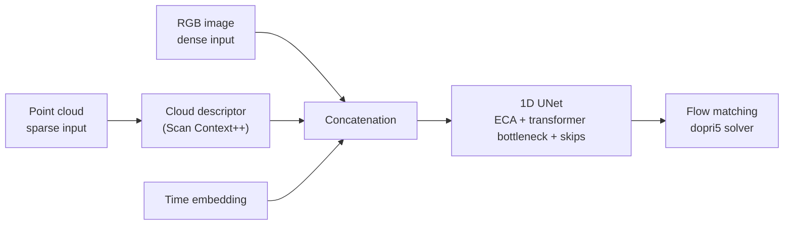

<Callout type="warn" title="Partially pending page">
No vision repository has been identified in the project. What follows comes from published
navigation work, not from the stack running on the robot.
</Callout>

## Multimodal perception (from the ICRA 2025 poster)

The [work presented at ICRA 2025](/en/docs/09-research/papers) combines two modalities:

| Modality | Source | Treatment |
| --- | --- | --- |
| **Dense** | RGB image | Used directly as input |
| **Sparse** | 3D point cloud | Encoded with a Scan Context++-style descriptor |

Both are concatenated and, together with a *time embedding*, feed a 1D UNet with efficient
channel attention (ECA) and a transformer bottleneck.

A limitation the work itself acknowledges: there is no unified multi-encoder able to fuse raw
RGB and point cloud. The modalities are concatenated, not natively fused.

## What is missing

- Is there a vision stack running on the ANYmal, separate from this research work?
- If so, what does it detect and with which models?
- Which cameras does the robot use, and how are they calibrated?
- Does it run onboard or off-board?

See [missing data](/en/docs/03-repositories/missing-data).
