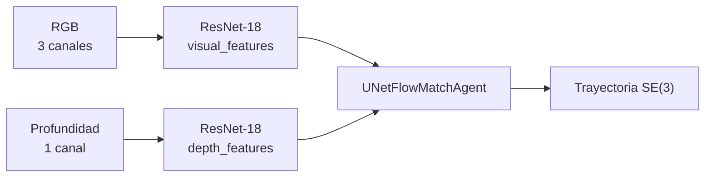

El proyecto usa la imagen en dos frentes muy distintos: **operación** (teleoperación e inspección
desde el robot) y **aprendizaje de trayectorias** (un modelo generativo entrenado sobre capturas
RGB + profundidad).

## Operación

El ANYmal expone [diez cámaras](/es/docs/04-hardware/cameras) como tópicos ROS: dos gran angular,
una PTZ con zoom 20x, una térmica y seis de profundidad. Se consumen desde la app de la Jetson
para teleoperación e inspección.

<Callout title="Ninguna cámara alimenta el SLAM">
El SLAM del proyecto es puramente LiDAR: el puente gRPC solo transmite odometría y escaneo 2D.
Ver [comunicación](/es/docs/05-software/communication).
</Callout>

## Generación de trayectorias — FLOWMAS-ANYmal

**Repositorio:** [`FLOWMAS-ANYmal`](https://github.com/carloAdr1/FLOWMAS-ANYmal) (privado)

Continuación del [trabajo de ICRA 2025](/es/docs/09-research/papers). El paquete se llama
`trajectory` y entrena un modelo de *flow matching* que predice trayectorias a partir de
observaciones visuales.

### Entradas

Las dos modalidades se codifican **por separado**, con dos ResNet-18 distintas: la de profundidad
está configurada con `input_channels: 1` y normalización por grupos. Ninguna hace *average
pooling*, así que el modelo recibe todos los tokens de la imagen.

Es un cambio respecto al póster de ICRA, que concatenaba RGB con un descriptor de nube de puntos
tipo Scan Context++. Aquí la segunda modalidad es profundidad densa, no nube dispersa.

### Salida

| Parámetro | Valor |
| --- | --- |
| `action_dim` | 9 — 3 de traslación + 6 de rotación, es decir SE(3) |
| `pred_horizon` | 8 pasos (10 con SCAND) |
| `obs_horizon` | 2 pasos |
| `action_horizon` | 8 pasos |

Predecir rotación completa en 6D es lo que permite analizar el movimiento que el robot decide
tomar, no solo su desplazamiento en el plano.

### Modelo

| Parámetro | Valor |
| --- | --- |
| Arquitectura | `UNetFlowMatchAgent` (también hay variantes transformer y con memoria espacial) |
| `embed_dim` | 512 |
| Pasos de flujo | 50 en entrenamiento, 100 en evaluación |
| `sigma` | 0.1 |
| Dropout | 0.3 |
| EMA | activada, decay 0.999 |
| Flow matching restringido | sí, `constraint_strength` 0.8 |

`flowmatch/ecat_unet.py` implementa la UNet con atención de canal eficiente (ECA), que es la
descrita en el póster.

### Entrenamiento

| Parámetro | Valor |
| --- | --- |
| Batch | 256 |
| Épocas | 51 |
| Learning rate | 1e-4, con 500 pasos de warmup |
| Weight decay | 1e-6 |

Configuración con Hydra; los datasets se almacenan en **Zarr**, y `utils/arkit_to_zarr.py`
convierte las capturas de ARKit a ese formato.

### Datasets soportados

| Config | Estado |
| --- | --- |
| `arkit` | Por defecto en la tarea de entrenamiento. Carga `rgb`, `depth`, `poses` y `actions` |
| `pusht` | Entorno de validación, el mismo del póster |
| `scand` | **Config presente, implementación ausente**: apunta a `flowmatch.scand.SCANDDataset`, que no está en el repositorio |

### Dependencias notables

`torchcfm` (conditional flow matching), `torchdyn` (solvers de ODE neuronales), `pot` (transporte
óptimo, la referencia 6 del póster), `diffusers`, `zarr`, `gym-pusht` y `rerun-sdk` para
visualización. Python 3.11.

## Lo que falta

- ¿Se ha ejecutado sobre el ANYmal? El código no lo menciona en ninguna parte.
- ¿Con qué dispositivo se capturan los datos ARKit, y quién los graba?
- Métricas de las trayectorias generadas.
- Por qué el dataset SCAND quedó sin implementación.

Ver [datos pendientes](/es/docs/03-repositories/missing-data).
