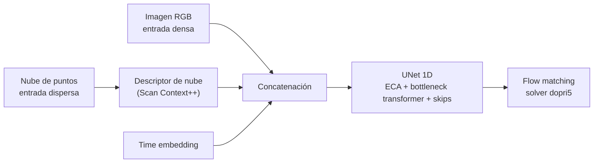

<Callout type="warn" title="Página parcialmente pendiente">
No hay un repositorio de visión identificado en el proyecto. Lo que sigue viene del trabajo de
navegación publicado, no de la pila que corre en el robot.
</Callout>

## Percepción multimodal (del póster de ICRA 2025)

El [trabajo presentado en ICRA 2025](/es/docs/09-research/papers) combina dos modalidades:

| Modalidad | Fuente | Tratamiento |
| --- | --- | --- |
| **Densa** | Imagen RGB | Se usa directamente como entrada |
| **Dispersa** | Nube de puntos 3D | Se codifica con un descriptor tipo Scan Context++ |

Ambas se concatenan y, junto a un *time embedding*, alimentan una UNet 1D con atención de canal
eficiente (ECA) y un cuello de botella transformer.

Una limitación que el propio trabajo reconoce: no hay un multi-encoder unificado capaz de fundir
RGB y nube de puntos en crudo. Las modalidades se concatenan, no se fusionan de forma nativa.

## Lo que falta

- ¿Hay una pila de visión corriendo en el ANYmal, aparte de este trabajo de investigación?
- Si la hay, ¿qué detecta y con qué modelos?
- ¿Qué cámaras usa el robot y cómo están calibradas?
- ¿Se ejecuta a bordo o fuera?

Ver [datos pendientes](/es/docs/03-repositories/missing-data).
