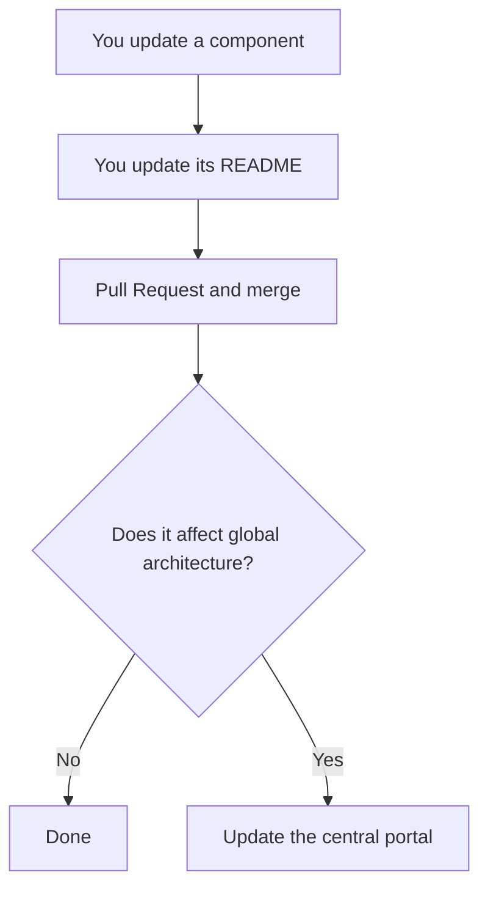

## In each component repository

Each team keeps its own workflow. The minimum asked:

1. Work on a branch, not directly on the main branch.
2. Open a Pull Request, even as a solo contributor: it leaves the change documented.
3. Update the README if the change affects installation, usage, configuration or interfaces.

## When the central portal must also be touched

Not on every commit. The trigger is a change that affects **how the whole system is
understood**:

Cases that do require a portal update:

| Change | What to update in the portal |
| --- | --- |
| New repository | `data/repositories.yaml` |
| Repository removed or archived | `data/repositories.yaml` |
| Maintainer change | `data/repositories.yaml` |
| Architecture change | `docs/02-architecture/` |
| New dependency between components | `docs/02-architecture/data-flow` |
| Sensor added or removed | `docs/04-hardware/` |
| Protocol or public interface change | `docs/05-software/communication` |
| Significant data-flow change | `docs/02-architecture/data-flow` |

## Hard rule about interfaces

> If you change a public interface, you update
> [communication](/en/docs/05-software/communication) in the same Pull Request.

Not in a follow-up issue, not "later". The interface table is only useful if it is current, and
it is only current if updating it is part of the change.

## In this documentation repository

1. One branch per change.
2. If you touch `data/repositories.yaml`, run `npm run gen:catalog` and commit the result. Never
   hand-edit the generated pages.
3. Check that `npm run build` passes before opening the Pull Request.
4. If you close an item in [missing data](/en/docs/03-repositories/missing-data), strike it off
   in the same Pull Request.

## Bilingual content

Each page has two files: `page.mdx` (Spanish) and `page.en.mdx` (English). When editing one,
update the other too. If you genuinely cannot translate at that moment, leave the English page
un-updated and note it: the portal serves the Spanish version automatically, so navigation does
not break — but it goes stale, which is worse than missing.
