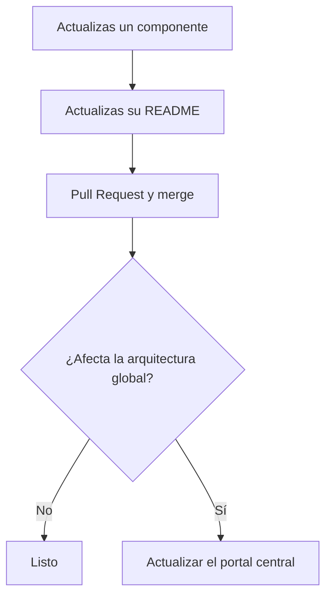

## En cada repositorio de componente

Cada equipo mantiene su propio flujo. Lo mínimo que se pide:

1. Trabajar en una rama, no directamente sobre la rama principal.
2. Abrir un Pull Request, aunque sea de una sola persona: deja el cambio documentado.
3. Actualizar el README si el cambio afecta instalación, uso, configuración o interfaces.

## Cuándo hay que tocar además el portal central

No en cada commit. El disparador es que el cambio afecte **cómo se entiende el sistema
completo**:

Casos que sí obligan a actualizar el portal:

| Cambio | Qué actualizar en el portal |
| --- | --- |
| Nuevo repositorio | `data/repositories.yaml` |
| Repositorio eliminado o archivado | `data/repositories.yaml` |
| Cambio de responsable | `data/repositories.yaml` |
| Cambio de arquitectura | `docs/02-architecture/` |
| Nueva dependencia entre componentes | `docs/02-architecture/data-flow` |
| Sensor añadido o retirado | `docs/04-hardware/` |
| Cambio de protocolo o de interfaz pública | `docs/05-software/communication` |
| Cambio importante en el flujo de datos | `docs/02-architecture/data-flow` |

## Regla dura sobre interfaces

> Si cambias una interfaz pública, actualizas
> [comunicación](/es/docs/05-software/communication) en el mismo Pull Request.

No en un issue de seguimiento, no "después". La tabla de interfaces solo sirve si está al día, y
solo está al día si actualizarla es parte del cambio.

## En este repositorio de documentación

1. Rama por cambio.
2. Si tocas `data/repositories.yaml`, ejecuta `npm run gen:catalog` y commitea el resultado.
   Nunca edites a mano las páginas generadas.
3. Verifica que `npm run build` pasa antes de abrir el Pull Request.
4. Si cierras un punto de [datos pendientes](/es/docs/03-repositories/missing-data), táchalo en
   el mismo Pull Request.

## Contenido bilingüe

Cada página tiene dos archivos: `pagina.mdx` (español) y `pagina.en.mdx` (inglés). Al editar una,
actualiza también la otra. Si de verdad no puedes traducir en ese momento, deja la página inglesa
sin actualizar y anótalo: el portal la sirve en español automáticamente, así que no se rompe la
navegación — pero queda desactualizada, que es peor que faltar.
