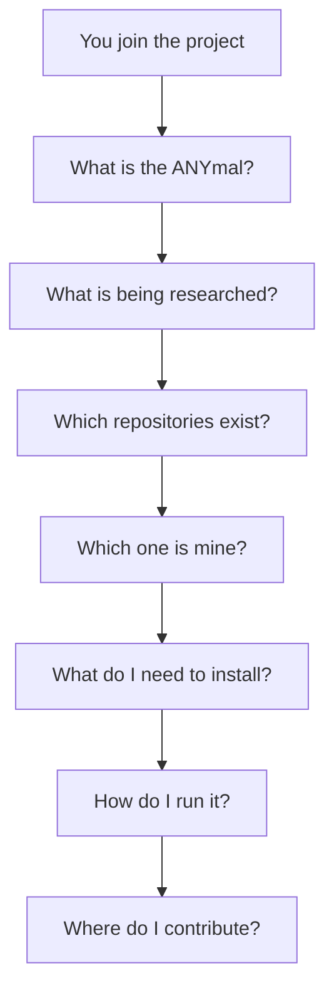

This page is both an index and a test. If you can answer all ten, you understand the project. If
not, the status column tells you whether the problem is yours or the documentation's.

| # | Question | Where | Status |
| --- | --- | --- | --- |
| 1 | What is the ANYmal? | [ANYmal D](/en/docs/04-hardware/anymal-d) | ✅ Documented |
| 2 | What is the goal of the research? | [Goals](/en/docs/01-introduction/goals) | 🟡 Partial |
| 3 | What hardware does it use? | [Hardware architecture](/en/docs/02-architecture/hardware-architecture) | 🟡 Partial |
| 4 | What software exists? | [Software architecture](/en/docs/02-architecture/software-architecture) | ✅ Documented |
| 5 | What are the repositories? | [Catalog](/en/docs/03-repositories/repository-catalog) | ✅ Documented |
| 6 | Who maintains each component? | [Catalog](/en/docs/03-repositories/repository-catalog) | ✅ Documented |
| 7 | How do they communicate? | [Communication](/en/docs/05-software/communication) | ✅ Documented |
| 8 | How do I set up my environment? | [Development environment](/en/docs/06-infrastructure/development-environment) | ✅ Documented |
| 9 | How do I run the system? | [SLAM](/en/docs/05-software/slam) · [Docker](/en/docs/06-infrastructure/docker) | ✅ Documented |
| 10 | Where should I contribute? | [Getting started](/en/docs/08-onboarding/getting-started) | ✅ Documented |

**Legend:** ✅ documented and verified · 🟡 partial, with marked gaps · ⚠️ no verified
information.

## Reading the status

Eight out of ten questions are complete. The operation chain — robot, gRPC bridge, SLAM and app —
is documented end to end, with its topics, its gRPC contract and its containers.

The remaining gap is the **physical hardware** (question 3): we know which topics each sensor
publishes, but not which sensor it is. Question 2 also remains open, depending on confirming the
research goals with each line of work.

What is left is listed in [missing data](/en/docs/03-repositories/missing-data).

## Visual map

