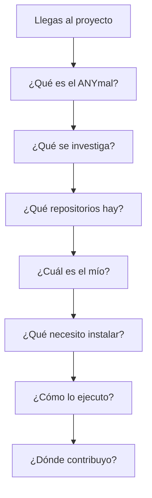

Esta página es a la vez un índice y una prueba. Si puedes responder las diez, entiendes el
proyecto. Si no, la casilla de estado te dice si el problema es tuyo o de la documentación.

| # | Pregunta | Dónde | Estado |
| --- | --- | --- | --- |
| 1 | ¿Qué es el ANYmal? | [ANYmal D](/es/docs/04-hardware/anymal-d) | ✅ Documentado |
| 2 | ¿Cuál es el objetivo de la investigación? | [Objetivos](/es/docs/01-introduction/goals) | 🟡 Parcial |
| 3 | ¿Qué hardware utiliza? | [Arquitectura de hardware](/es/docs/02-architecture/hardware-architecture) | 🟡 Parcial |
| 4 | ¿Qué software existe? | [Arquitectura de software](/es/docs/02-architecture/software-architecture) | ✅ Documentado |
| 5 | ¿Cuáles son los repositorios? | [Catálogo](/es/docs/03-repositories/repository-catalog) | ✅ Documentado |
| 6 | ¿Quién mantiene cada componente? | [Catálogo](/es/docs/03-repositories/repository-catalog) | ✅ Documentado |
| 7 | ¿Cómo se comunican entre sí? | [Comunicación](/es/docs/05-software/communication) | ✅ Documentado |
| 8 | ¿Cómo preparo mi entorno? | [Entorno de desarrollo](/es/docs/06-infrastructure/development-environment) | ✅ Documentado |
| 9 | ¿Cómo ejecuto el sistema? | [SLAM](/es/docs/05-software/slam) · [Docker](/es/docs/06-infrastructure/docker) | ✅ Documentado |
| 10 | ¿Dónde debo contribuir? | [Primeros pasos](/es/docs/08-onboarding/getting-started) | ✅ Documentado |

**Leyenda:** ✅ documentado y verificado · 🟡 parcial, con huecos marcados · ⚠️ sin información
verificada.

## Lectura del estado

Ocho de diez preguntas están completas. La cadena de operación —robot, puente gRPC, SLAM y app—
está documentada de punta a punta, con sus tópicos, su contrato gRPC y sus contenedores.

El hueco que queda es el **hardware físico** (pregunta 3): sabemos qué tópicos publica cada
sensor, pero no qué sensor es. Falta también cerrar la pregunta 2, que depende de confirmar los
objetivos de investigación con cada línea de trabajo.

Lo pendiente está listado en [datos pendientes](/es/docs/03-repositories/missing-data).

## Mapa visual

