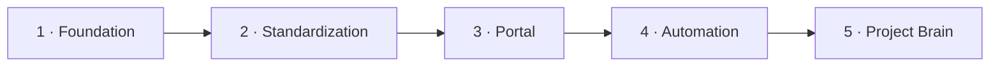
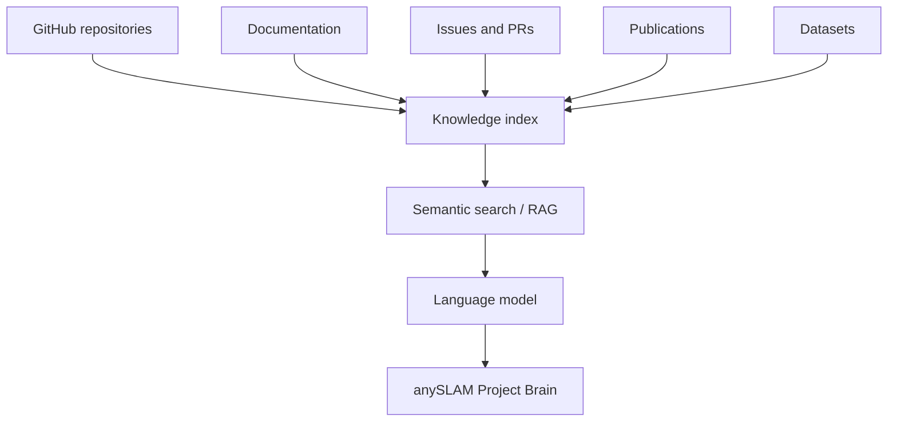

This roadmap covers the **documentation portal**, not the research.

## Phase 1 — Foundation ✅

- [x] Create the central repository.
- [x] Create the main README.
- [x] Create the `docs/` structure.
- [x] Inventory the existing repositories.
- [x] Identify maintainers.
- [x] Create the initial architecture diagram.

## Phase 2 — Standardization ✅

- [x] Create the standard README template (`templates/README.template.en.md`).
- [x] Define the repository standard.
- [x] Define naming conventions.
- [x] Define the Pull Request workflow.
- [ ] **Share it with every team and have them adopt it.** This depends on people, not on code.

## Phase 3 — Documentation Portal ✅

- [x] Next.js 16 application with Fumadocs.
- [x] Content in Markdown / MDX.
- [x] Sidebar and navigation.
- [x] Built-in search.
- [x] Bilingual Spanish / English support with automatic fallback.
- [x] Server-rendered Mermaid diagrams.
- [ ] **Public deployment.** Where it is hosted and under what URL is still undecided.

## Phase 4 — Automation 🔜

None of this is done yet.

- [ ] Query the GitHub API for repository metadata.
- [ ] Automatically show last update, releases and status.
- [ ] Validate that repositories follow the README template.
- [ ] Check for broken links in CI.
- [ ] Detect potentially stale documentation.
- [ ] Complete `scripts/bootstrap.sh` to clone the full workspace.

`data/repositories.yaml` is already structured to feed all of this.

## Phase 5 — Project Brain 🔮

A semantic search layer over the project's knowledge.

The quality of this phase depends directly on the quality of the documentation from earlier
phases. A semantic index over incomplete documentation produces incomplete answers in a
confident tone, which is worse than having nothing.

That is why the real priority now is neither phase 4 nor phase 5, but closing the gaps in
[missing data](/en/docs/03-repositories/missing-data).

## Immediate priority

| # | Task | Blocked by |
| --- | --- | --- |
| 1 | Access to the 4 private repositories | Their maintainers |
| 2 | ROS interface table | ROS team |
| 3 | Robot hardware inventory | Hardware team |
| 4 | Decide licence and deployment URL | Project coordination |
