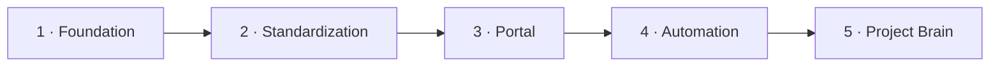
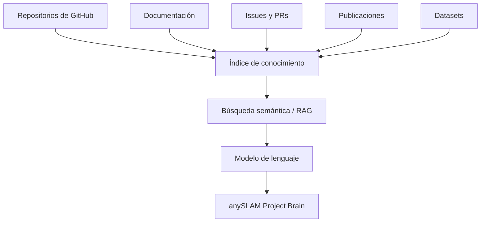

Este roadmap es el del **portal de documentación**, no el de la investigación.

## Fase 1 — Foundation ✅

- [x] Crear el repositorio central.
- [x] Crear el README principal.
- [x] Crear la estructura `docs/`.
- [x] Inventariar los repositorios existentes.
- [x] Identificar responsables.
- [x] Crear el diagrama inicial de arquitectura.

## Fase 2 — Standardization ✅

- [x] Crear la plantilla estándar de README (`templates/README.template.md`).
- [x] Definir el estándar de repositorio.
- [x] Definir convenciones de nombres.
- [x] Definir el flujo de Pull Requests.
- [ ] **Compartirla con todos los equipos y que la adopten.** Esto depende de las personas, no
      del código.

## Fase 3 — Documentation Portal ✅

- [x] Aplicación Next.js 16 con Fumadocs.
- [x] Contenido en Markdown / MDX.
- [x] Menú lateral y navegación.
- [x] Búsqueda integrada.
- [x] Soporte bilingüe español / inglés con retroceso automático.
- [x] Diagramas Mermaid renderizados en servidor.
- [ ] **Despliegue público.** Falta decidir dónde se aloja y con qué URL.

## Fase 4 — Automation 🔜

Nada de esto está hecho todavía.

- [ ] Consultar la API de GitHub para obtener metadatos de los repositorios.
- [ ] Mostrar automáticamente última actualización, releases y estado.
- [ ] Validar que los repositorios cumplen la plantilla de README.
- [ ] Verificar enlaces rotos en CI.
- [ ] Detectar documentación potencialmente desactualizada.
- [ ] Completar `scripts/bootstrap.sh` para clonar el workspace completo.

`data/repositories.yaml` ya está estructurado para alimentar todo esto.

## Fase 5 — Project Brain 🔮

Capa de búsqueda semántica sobre el conocimiento del proyecto.

La calidad de esta fase depende directamente de la calidad de la documentación de las fases
anteriores. Un índice semántico sobre documentación incompleta produce respuestas incompletas
con tono seguro, que es peor que no tener nada.

Por eso la prioridad real ahora no es la fase 4 ni la 5, sino cerrar los huecos de
[datos pendientes](/es/docs/03-repositories/missing-data).

## Prioridad inmediata

| # | Tarea | Bloqueado por |
| --- | --- | --- |
| 1 | Acceso a los 4 repositorios privados | Sus responsables |
| 2 | Tabla de interfaces ROS | Equipo ROS |
| 3 | Inventario de hardware del robot | Equipo hardware |
| 4 | Decidir licencia y URL de despliegue | Coordinación del proyecto |
