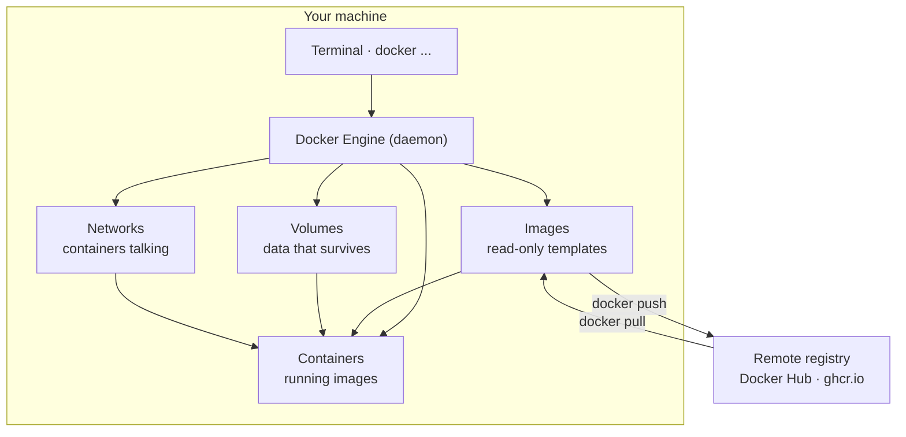
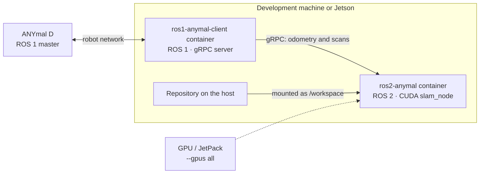

Docker packages a program together with everything it needs to run — libraries, versions,
environment variables — into an **image**. When that image runs it becomes a **container**: a
process isolated from the rest of your system.

For us it solves a concrete problem: ROS 1 and ROS 2 require different Ubuntu versions and do not
coexist well on the same machine. In containers they do.

## Where it lives on your computer



Four ideas worth having clear before memorising commands:

| Object | What it is | What happens if you delete it |
| --- | --- | --- |
| Image | The template. It does not run; you build it or pull it. | It gets pulled or built again. |
| Container | The image running. Disposable by design. | You lose whatever was **inside** the container. |
| Volume | Storage managed by Docker, outside the container. | **You lose the data.** Maps, databases and rosbags live here. |
| Network | The virtual cable between containers. | They stop seeing each other. |

What you write in the `Dockerfile` builds the image; what you write in `compose.yaml` describes
how several containers come up together.

## How it is used in a robotics project

In anySLAM the two sides of the system are separate containers, each with its own ROS
distribution, talking over gRPC. Each container mounts its repository as `/workspace`, so the code
running inside is the code you edit outside:



Three details that only show up once a container talks to real hardware:

- **`--gpus all`** so the container sees the GPU. It needs the NVIDIA Container Toolkit on the
  host; without it, the CUDA inside is useless.
- **`--device /dev/ttyUSB0`** to expose a serial port, a LiDAR or a camera.
- **`--network host`** is common with ROS, because node discovery uses multicast and on the
  default `bridge` network the nodes never find each other.

How those two containers are actually built — the automatic platform detection, the `build.sh` and
`run.sh` scripts, the mounts — is in [Docker (infrastructure)](/en/docs/06-infrastructure/docker).
That page describes **our setup**; this one explains **the tool**.

## Before you type commands

| Rule | Detail |
| --- | --- |
| `docker compose`, not `docker-compose` | Compose v1 (hyphenated, in Python) reached end of life in July 2023. The current one is the CLI plugin, with a space. |
| The file is called `compose.yaml` | Preferred over `docker-compose.yml`. The `version:` key is ignored now: remove it. |
| Modern per-object syntax | `docker ps` still works, but the canonical form is `docker container ls`, `docker image ls`. Use the new one in new scripts. |

Check your installation:

```bash
docker version           # client and engine versions
docker compose version   # v5.x — no hyphen
docker info              # system state, driver, resources
docker run hello-world   # smoke test
```

## Command search

<CommandSearch tech="docker" lang="en" />

## `docker run` flags you will see all the time

| Flag | What it is for |
| --- | --- |
| `-d` | Runs in the background. |
| `-it` | Interactive terminal (`-i` keeps stdin, `-t` allocates a TTY). |
| `--rm` | Removes the container on exit. |
| `--name` | A fixed name instead of a random one. |
| `-p 8080:80` | Publishes container port 80 on host port 8080. |
| `-v` / `--mount` | Mounts volumes or host directories. |
| `-e` / `--env-file` | Environment variables, inline or from a file. |
| `-u` | User the process runs as (`-u $(id -u):$(id -g)`). |
| `--network` | Network to attach to (`bridge`, `host`, or your own). |
| `--restart` | Restart policy (`no`, `on-failure`, `always`, `unless-stopped`). |
| `--memory` / `--cpus` | Resource limits. |
| `--device` | Exposes a host device (`--device /dev/ttyUSB0`). |
| `--gpus` | GPU access (`--gpus all`, needs the NVIDIA Container Toolkit). |
| `--entrypoint` | Replaces the image's entry executable. |

Mounting data:

```bash
docker run -v maps:/data/maps ros2-slam:1.0                   # named volume
docker run -v "$PWD/config":/app/config:ro ros2-slam:1.0      # read-only bind mount
docker run --mount type=volume,source=maps,target=/data/maps ros2-slam:1.0
```

## Everyday recipes

```bash
# Shell inside a container that is already running
docker exec -it ros2-slam bash

# Throwaway container to try something
docker run --rm -it alpine:3.21 sh

# Find out why a container died
docker inspect -f '{{.State.ExitCode}} {{.State.Error}}' ros2-slam
docker logs --tail 200 ros2-slam

# Stop and remove everything that is running
docker rm -f $(docker ps -aq)

# Rebuild a single service without touching the rest
docker compose up -d --build --no-deps slam

# Start from scratch, no cache and no old data
docker compose down -v && docker compose build --no-cache && docker compose up -d

# Pull out a rosbag generated inside the container
docker cp ros2-slam:/data/bags/run42.bag ./run42.bag

# See what is eating disk
docker system df -v
```

## Common errors

| Symptom | Usual cause | Fix |
| --- | --- | --- |
| `port is already allocated` | Another process or container holds that port. | `docker ps` and change the mapping, or free the port. |
| `no such file or directory` when building | The path is outside the build context or excluded by `.dockerignore`. | Check the context (the trailing `.`) and `.dockerignore`. |
| Code changes do not show up | The layer was cached. | `docker compose up -d --build` or `docker build --no-cache`. |
| `permission denied` on mounted files | The container's UID is not yours. | `-u $(id -u):$(id -g)` or fix the directory permissions. |
| The container starts and dies silently | The main process exited. | `docker logs`; PID 1 must stay in the foreground. |
| `docker-compose: command not found` | Compose v1 no longer exists. | Use `docker compose`, with a space. |
| `failed to connect to the docker API` · `Cannot connect to the Docker daemon` | The CLI is installed but the daemon is not running. | Open Docker Desktop, or `sudo systemctl start docker` on Linux. `docker --version` answers with no daemon, which tells "not installed" apart from "not running". |
| ROS nodes cannot see each other across containers | The `bridge` network does not carry multicast. | `--network host`, or your own network using service names. |
| `could not select device driver "nvidia"` | The NVIDIA Container Toolkit is missing on the host. | Install it and restart the daemon; check with `docker run --gpus all nvidia/cuda nvidia-smi`. |

<Callout type="warn" title="One command that really hurts">
  `docker system prune -a --volumes` deletes **data**: volumes with maps, databases and rosbags
  that nobody has mounted at that moment. Never run it on a shared machine or on the robot's
  Jetson without telling the team.
</Callout>

## To learn more

| Resource | What it is |
| --- | --- |
| [Docker: Get started](https://docs.docker.com/get-started/) | The official tutorial, from zero to Compose. |
| [CLI reference](https://docs.docker.com/reference/cli/docker/) | Every command and flag — the source for this page. |
| [Compose file reference](https://docs.docker.com/reference/compose-file/) | Everything `compose.yaml` can contain. |
| [Play with Docker](https://labs.play-with-docker.com/) | A Docker terminal in the browser, to try things without installing anything. |

<Callout title="Videos are missing">
  This table has no video material yet, and none of the notes from the people who have already
  fought Docker on the Jetson. If a video helped you, send it to whoever maintains the portal with
  one line on why it is worth the time.
</Callout>
