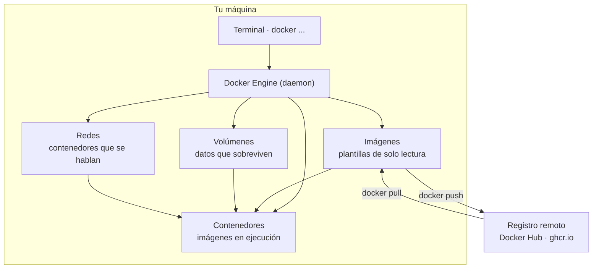
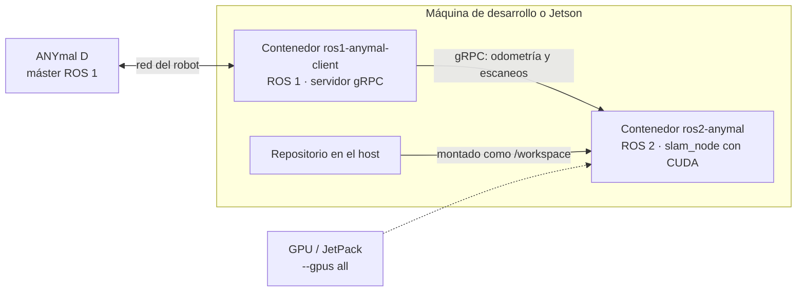

Docker empaqueta un programa junto con todo lo que necesita para correr —librerías, versiones,
variables de entorno— en una **imagen**. Cuando esa imagen se ejecuta se convierte en un
**contenedor**: un proceso aislado del resto de tu sistema.

Para nosotros eso resuelve un problema concreto: ROS 1 y ROS 2 exigen versiones de Ubuntu
distintas y no conviven bien en la misma máquina. En contenedores sí conviven.

## Cómo vive en tu computadora



Cuatro ideas que conviene tener claras antes de memorizar comandos:

| Objeto | Qué es | Qué pasa si lo borras |
| --- | --- | --- |
| Imagen | La plantilla. No corre, se construye o se descarga. | Se vuelve a descargar o a construir. |
| Contenedor | La imagen ejecutándose. Es desechable por diseño. | Se pierde lo que estaba **dentro** del contenedor. |
| Volumen | Almacenamiento gestionado por Docker, fuera del contenedor. | **Se pierden los datos.** Aquí viven mapas, bases y rosbags. |
| Red | El cable virtual entre contenedores. | Dejan de verse entre ellos. |

Lo que escribes en el `Dockerfile` construye la imagen; lo que escribes en `compose.yaml`
describe cómo se levantan varios contenedores juntos.

## Cómo se usa en un proyecto de robótica

En anySLAM los dos lados del sistema son contenedores separados, cada uno con la distribución de
ROS que le toca, hablando por gRPC. Cada contenedor monta su repositorio como `/workspace`, así
que el código que corre dentro es el que editas fuera:



Tres detalles que solo aparecen cuando el contenedor habla con hardware real:

- **`--gpus all`** para que el contenedor vea la GPU. Requiere NVIDIA Container Toolkit en el
  host; sin él, el CUDA de dentro no sirve de nada.
- **`--device /dev/ttyUSB0`** para exponer un puerto serie, un LiDAR o una cámara.
- **`--network host`** es habitual con ROS, porque el descubrimiento de nodos usa multicast y con
  la red `bridge` por defecto los nodos no se encuentran.

Cómo están construidos de verdad esos dos contenedores —la detección automática de plataforma, los
`build.sh` y `run.sh`, los montajes— está en
[Docker (infraestructura)](/es/docs/06-infrastructure/docker). Esa página describe **nuestro
montaje**; esta explica **la herramienta**.

## Antes de escribir comandos

| Regla | Detalle |
| --- | --- |
| `docker compose`, no `docker-compose` | Compose v1 (con guion, en Python) llegó a su fin de vida en julio de 2023. Lo vigente es el plugin del CLI, con espacio. |
| El archivo se llama `compose.yaml` | Preferido sobre `docker-compose.yml`. La clave `version:` ya se ignora: quítala. |
| Sintaxis moderna por objeto | `docker ps` sigue funcionando, pero la forma canónica es `docker container ls`, `docker image ls`. Usa la nueva en scripts nuevos. |

Verifica tu instalación:

```bash
docker version           # versión de cliente y engine
docker compose version   # v5.x — sin guion
docker info              # estado del sistema, driver, recursos
docker run hello-world   # prueba de humo
```

## Buscador de comandos

<CommandSearch tech="docker" />

## Flags de `docker run` que verás todo el tiempo

| Flag | Para qué sirve |
| --- | --- |
| `-d` | Ejecuta en segundo plano. |
| `-it` | Terminal interactiva (`-i` mantiene stdin, `-t` asigna TTY). |
| `--rm` | Elimina el contenedor al salir. |
| `--name` | Nombre fijo en lugar de uno aleatorio. |
| `-p 8080:80` | Publica el puerto 80 del contenedor en el 8080 del host. |
| `-v` / `--mount` | Monta volúmenes o directorios del host. |
| `-e` / `--env-file` | Variables de entorno, sueltas o desde archivo. |
| `-u` | Usuario con el que corre el proceso (`-u $(id -u):$(id -g)`). |
| `--network` | Red a la que se conecta (`bridge`, `host`, o una propia). |
| `--restart` | Política de reinicio (`no`, `on-failure`, `always`, `unless-stopped`). |
| `--memory` / `--cpus` | Límites de recursos. |
| `--device` | Expone un dispositivo del host (`--device /dev/ttyUSB0`). |
| `--gpus` | Acceso a GPU (`--gpus all`, requiere NVIDIA Container Toolkit). |
| `--entrypoint` | Sustituye el ejecutable de entrada de la imagen. |

Montar datos:

```bash
docker run -v mapas:/data/maps ros2-slam:1.0                  # volumen con nombre
docker run -v "$PWD/config":/app/config:ro ros2-slam:1.0      # bind mount de solo lectura
docker run --mount type=volume,source=mapas,target=/data/maps ros2-slam:1.0
```

## Recetas de uso diario

```bash
# Shell dentro de un contenedor que ya está corriendo
docker exec -it ros2-slam bash

# Contenedor desechable para probar algo
docker run --rm -it alpine:3.21 sh

# Ver por qué murió un contenedor
docker inspect -f '{{.State.ExitCode}} {{.State.Error}}' ros2-slam
docker logs --tail 200 ros2-slam

# Parar y borrar todo lo que esté corriendo
docker rm -f $(docker ps -aq)

# Reconstruir un solo servicio sin tocar los demás
docker compose up -d --build --no-deps slam

# Levantar de cero, sin caché ni datos viejos
docker compose down -v && docker compose build --no-cache && docker compose up -d

# Sacar un rosbag generado dentro del contenedor
docker cp ros2-slam:/data/bags/run42.bag ./run42.bag

# Ver qué está comiendo disco
docker system df -v
```

## Errores comunes

| Síntoma | Causa habitual | Solución |
| --- | --- | --- |
| `port is already allocated` | Otro proceso o contenedor usa ese puerto. | `docker ps` y cambia el mapeo, o libera el puerto. |
| `no such file or directory` al construir | La ruta no está en el contexto de build o la excluye `.dockerignore`. | Revisa el contexto (el `.` final) y el `.dockerignore`. |
| Los cambios de código no aparecen | La capa quedó cacheada. | `docker compose up -d --build` o `docker build --no-cache`. |
| `permission denied` en archivos montados | El UID del contenedor no es el tuyo. | `-u $(id -u):$(id -g)` o ajusta permisos del directorio. |
| El contenedor arranca y muere sin error | El proceso principal terminó. | `docker logs`; el PID 1 debe quedarse en primer plano. |
| `docker-compose: command not found` | Compose v1 ya no existe. | Usa `docker compose`, con espacio. |
| `failed to connect to the docker API` · `Cannot connect to the Docker daemon` | El CLI está instalado pero el daemon no corre. | Abre Docker Desktop, o `sudo systemctl start docker` en Linux. `docker --version` responde igual sin daemon: sirve para distinguir «no está instalado» de «no está encendido». |
| Los nodos de ROS no se ven entre contenedores | La red `bridge` no pasa multicast. | `--network host` o una red propia con nombres de servicio. |
| `could not select device driver "nvidia"` | Falta NVIDIA Container Toolkit en el host. | Instálalo y reinicia el daemon; verifica con `docker run --gpus all nvidia/cuda nvidia-smi`. |

<Callout type="warn" title="Un comando que sí duele">
  `docker system prune -a --volumes` borra **datos**: volúmenes con mapas, bases y rosbags que
  nadie tenga montados en ese momento. Nunca lo ejecutes en una máquina compartida ni en la
  Jetson del robot sin avisar al equipo.
</Callout>

## Para aprender

| Recurso | Qué es |
| --- | --- |
| [Docker: Get started](https://docs.docker.com/get-started/) | El tutorial oficial, de cero a Compose. |
| [Referencia del CLI](https://docs.docker.com/reference/cli/docker/) | Todos los comandos y sus flags, la fuente de esta página. |
| [Referencia de Compose](https://docs.docker.com/reference/compose-file/) | Todo lo que puede llevar `compose.yaml`. |
| [Play with Docker](https://labs.play-with-docker.com/) | Una terminal con Docker en el navegador, para probar sin instalar nada. |

<Callout title="Faltan los videos">
  Esta tabla todavía no tiene material en video ni las notas de quienes ya pelearon con Docker en
  la Jetson. Si encontraste un video que te sirvió, pásaselo a quien mantiene el portal con una
  línea de por qué vale la pena y se agrega aquí.
</Callout>
