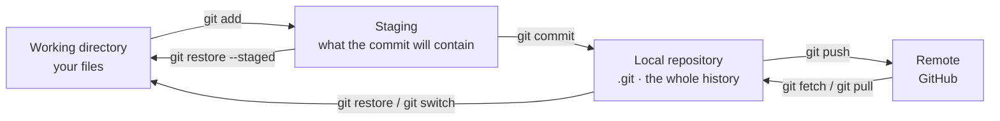
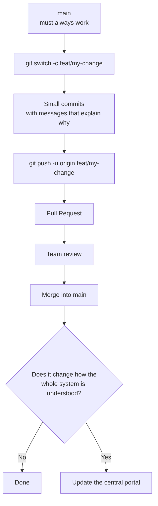

Git stores **complete snapshots of the project** every time you commit, along with who made the
change and why. It is not just insurance against losing work: it answers "since when has this been
broken?" and "why is this line the way it is?".

Almost all of Git happens on your machine. GitHub is just one more copy of the repository — the
one everybody shares.

## Where it lives on your computer



Nearly every Git tangle becomes clear from this diagram: the question is always **which area the
change is in** before you move or discard it.

| Area | Where it is | How you look at it |
| --- | --- | --- |
| Working directory | The files your editor edits. | `git status`, `git diff` |
| Staging | An in-between area: what the next commit will contain. | `git diff --staged` |
| Local repository | The `.git` folder. Holds the entire history, offline. | `git log` |
| Remote | The copy on GitHub the team shares. | `git fetch`, `git log origin/main` |

<Callout title="The .git folder is the repository">
  Delete `.git` and the whole history is gone, even though the files remain. And the other way
  around: when you clone, you get the full history, not just the latest version.
</Callout>

## How it is used in the project

anySLAM is not one repository but several: every component has its own and this portal documents
them. The minimum flow the project asks for is the same in all of them:



The full rules — when the portal has to be updated too, the hard rule about interfaces — are in
[Git workflow](/en/docs/07-standards/git-workflow). This page is the command reference; that one
is the team's agreement.

Set your identity before your first commit, or the commits will belong to nobody:

```bash
git config --global user.name "Your Name"
git config --global user.email "your.email@tec.mx"
git config --global init.defaultBranch main
git config --global pull.rebase true    # linear history when updating
```

## Command search

<CommandSearch tech="git" lang="en" />

## Situations that keep coming back

| What happened | What to do |
| --- | --- |
| I committed on `main` instead of a branch. | `git switch -c feat/my-change`, then `git switch main && git reset --hard origin/main`. |
| I forgot a file in the last commit. | `git add forgotten.py && git commit --amend --no-edit`. |
| The last commit message is wrong. | `git commit --amend` (only if you have not pushed it). |
| I need to switch branches with work half done. | `git stash`, switch, then `git stash pop`. |
| I broke something and do not know what I touched. | `git diff` to see it, `git restore <file>` to drop it. |
| I deleted a commit and I need it. | `git reflog`, find the hash, then `git switch -c rescue <hash>`. |
| My branch fell behind `main`. | `git fetch origin && git rebase origin/main`. |
| The commit I need is on another branch. | `git cherry-pick <hash>`. |
| I already pushed it and it is wrong. | `git revert <hash>`: undoes without rewriting what others already have. |
| I do not know since when it fails. | `git bisect start`, mark a good commit and a bad one. |

## Common errors

| Symptom | Usual cause | Fix |
| --- | --- | --- |
| `rejected · non-fast-forward` on push | Someone pushed before you. | `git pull --rebase`, then push again. |
| Merge conflicts | Two branches touched the same lines. | Edit the `<<<<<<<` markers, `git add` the file, then `git rebase --continue` (or `git commit` for a merge). |
| `detached HEAD` | You are on a commit, not on a branch. | `git switch -c new-branch` to keep the work, or `git switch main` to leave. |
| A file never shows in `git status` | `.gitignore` ignores it. | `git check-ignore -v <file>` tells you which rule does it. |
| `Permission denied (publickey)` | Your SSH key is not on GitHub. | Generate one with `ssh-keygen -t ed25519` and add it to GitHub. |
| The repository weighs hundreds of MB | Rosbags, models or datasets were committed. | Move them to Git LFS or out of the repository: deleting them in a new commit does not shrink it. |

<Callout type="warn" title="The ones that really delete">
  `git reset --hard` and `git clean -fd` do not ask and do not use the trash. `git clean -nd`
  shows you what would go first. And `git push --force` on a shared branch destroys other people's
  work: use `--force-with-lease`, which refuses if anyone pushed since your last fetch.
</Callout>

## To learn more

| Resource | What it is |
| --- | --- |
| [Pro Git](https://git-scm.com/book/en/v2) | The official book, complete and free. Chapters 2 and 3 cover 90 % of daily use. |
| [Learn Git Branching](https://learngitbranching.js.org/) | Branches, merge and rebase, visual and interactive. The fastest way to understand `rebase`. |
| [Official command reference](https://git-scm.com/docs) | The documentation for every command and flag. |
| [Dangit, Git!?!](https://dangitgit.com/) | Recipes for getting out of the most common tangles. |

<Callout title="Videos are missing">
  Same as in the Docker guide: if a video finally made branching or rebasing click for you, pass it
  on with one line on why it helped. A link somebody on the team has actually watched beats ten
  from a search.
</Callout>
