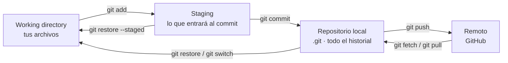
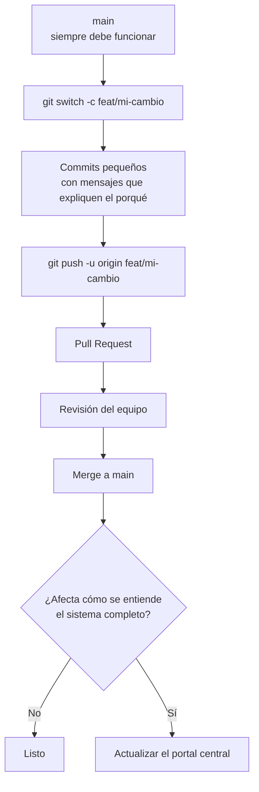

Git guarda **fotos completas del proyecto** cada vez que haces un commit, junto con quién lo hizo
y por qué. No sirve solo para no perder trabajo: sirve para responder «¿desde cuándo está roto
esto?» y «¿por qué esta línea está así?».

Casi todo Git ocurre en tu máquina. GitHub es solo una copia más del repositorio, la que todos
comparten.

## Cómo vive en tu computadora



Casi todos los enredos con Git se entienden mirando este diagrama: la pregunta siempre es **en
qué zona está el cambio** que quieres mover o descartar.

| Zona | Dónde está | Cómo se ve |
| --- | --- | --- |
| Working directory | Los archivos que edita tu editor. | `git status`, `git diff` |
| Staging | Un área intermedia: lo que entrará al próximo commit. | `git diff --staged` |
| Repositorio local | La carpeta `.git`. Contiene todo el historial, sin red. | `git log` |
| Remoto | La copia en GitHub que comparte el equipo. | `git fetch`, `git log origin/main` |

<Callout title="La carpeta .git es el repositorio">
  Si borras `.git` pierdes el historial completo, aunque los archivos sigan ahí. Y al revés: si
  clonas, te llevas todo el historial, no solo la última versión.
</Callout>

## Cómo se usa en el proyecto

anySLAM no es un repositorio, son varios: cada componente tiene el suyo y este portal los
documenta. El flujo mínimo que pide el proyecto es el mismo en todos:



Las reglas completas —cuándo hay que tocar además el portal, la regla dura sobre interfaces— están
en [Flujo de trabajo con Git](/es/docs/07-standards/git-workflow). Esta página es la referencia
de comandos; esa es el acuerdo del equipo.

Configura tu identidad antes del primer commit, o los commits quedarán a nombre de nadie:

```bash
git config --global user.name "Tu Nombre"
git config --global user.email "tu.correo@tec.mx"
git config --global init.defaultBranch main
git config --global pull.rebase true    # historial lineal al actualizar
```

## Buscador de comandos

<CommandSearch tech="git" />

## Situaciones que se repiten

| Lo que pasó | Qué hacer |
| --- | --- |
| Hice el commit en `main` en vez de en una rama. | `git switch -c feat/mi-cambio` y luego `git switch main && git reset --hard origin/main`. |
| Me faltó un archivo en el último commit. | `git add olvidado.py && git commit --amend --no-edit`. |
| El mensaje del último commit está mal. | `git commit --amend` (solo si no lo has subido). |
| Necesito cambiar de rama pero tengo cambios a medias. | `git stash`, cambias, y luego `git stash pop`. |
| Rompí algo y no sé qué toqué. | `git diff` para verlo, `git restore <archivo>` para descartarlo. |
| Borré un commit y lo necesito. | `git reflog`, busca el hash y `git switch -c rescate <hash>`. |
| Mi rama quedó atrás respecto a `main`. | `git fetch origin && git rebase origin/main`. |
| Un commit de otra rama es el que necesito. | `git cherry-pick <hash>`. |
| Ya lo subí y está mal. | `git revert <hash>`: deshace sin reescribir lo que otros ya tienen. |
| No sé desde cuándo falla. | `git bisect start`, marca un commit bueno y uno malo. |

## Errores comunes

| Síntoma | Causa habitual | Solución |
| --- | --- | --- |
| `rejected · non-fast-forward` al hacer push | Alguien subió antes que tú. | `git pull --rebase` y vuelve a subir. |
| Conflictos de merge | Dos ramas tocaron las mismas líneas. | Edita las marcas `<<<<<<<`, `git add` el archivo y `git rebase --continue` (o `git commit` si era merge). |
| `detached HEAD` | Estás sobre un commit, no sobre una rama. | `git switch -c rama-nueva` para conservar el trabajo, o `git switch main` para salir. |
| Un archivo no aparece en `git status` | Lo ignora `.gitignore`. | `git check-ignore -v <archivo>` dice qué regla lo ignora. |
| `Permission denied (publickey)` | Falta tu llave SSH en GitHub. | Genera una con `ssh-keygen -t ed25519` y súbela a GitHub. |
| El repositorio pesa cientos de MB | Se subieron rosbags, modelos o datasets. | Muévelos a Git LFS o fuera del repositorio: borrarlos en un commit nuevo no reduce el tamaño. |

<Callout type="warn" title="Los que borran de verdad">
  `git reset --hard` y `git clean -fd` no preguntan y no van a la papelera. `git clean -nd`
  primero te enseña qué borraría. Y `git push --force` sobre una rama compartida borra trabajo de
  otras personas: usa `--force-with-lease`, que se niega si alguien subió algo desde tu último
  fetch.
</Callout>

## Para aprender

| Recurso | Qué es |
| --- | --- |
| [Pro Git, en español](https://git-scm.com/book/es/v2) | El libro oficial, completo y gratis. Los capítulos 2 y 3 cubren el 90 % del uso diario. |
| [Learn Git Branching](https://learngitbranching.js.org/?locale=es_ES) | Ramas, merge y rebase de forma visual e interactiva. Lo más rápido para entender `rebase`. |
| [Referencia oficial de comandos](https://git-scm.com/docs) | La documentación de cada comando, con todos sus flags. |
| [Dangit, Git!?!](https://dangitgit.com/es) | Recetas para salir de los enredos más comunes. |

<Callout title="Faltan los videos">
  Igual que en la guía de Docker: si un video te resolvió el tema de ramas o de rebase, pásalo con
  una línea de por qué te sirvió. Vale más un enlace que alguien del equipo ya probó que diez de
  una búsqueda.
</Callout>
