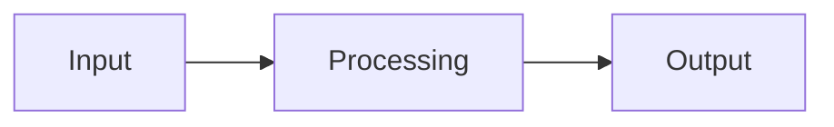

# Repository name

Short description of the component, in one or two sentences.

## Project

This repository is part of the **anySLAM** project, the SLAM, navigation and learned-locomotion
research on the ANYmal D robot at Tecnológico de Monterrey.

[← Back to the main portal](PORTAL_URL)

## Overview

Why this repository exists and what problem it solves.

## Responsibilities

What this component is responsible for within the system, and what it explicitly is not. Being
clear about what it does *not* do stops other teams assuming too much.

## Architecture

How it is organised internally: modules, nodes, main flow. A Mermaid diagram helps:



## Dependencies

| Dependency | Version | Purpose |
| --- | --- | --- |
| | | |

## Interfaces

How this component communicates with the rest of the system. **This is the most important
section of the README**: without it, another team cannot integrate without reading your code.

### ROS topics

| Topic | Type | Direction | Rate | Description |
| --- | --- | --- | --- | --- |
| | | publishes / subscribes | | |

### ROS services and actions

| Name | Type | Description |
| --- | --- | --- |
| | | |

### Other interfaces

APIs, sockets, ports, files, sensors.

## Installation

Steps to install from scratch on a clean machine.

```bash
# commands
```

## Usage

How to run it, with at least one concrete working example.

```bash
# commands
```

## Configuration

| Variable / file | Default | Description |
| --- | --- | --- |
| | | |

## Development

How to work on the code locally.

## Testing

How to run the tests.

```bash
# commands
```

## Maintainers

- Name — [@handle](https://github.com/handle)

## Status

`Active` · `Development` · `Experimental` · `Deprecated`

*(keep only the one that applies)*

## Related repositories

| Repository | Relationship |
| --- | --- |
| | |
