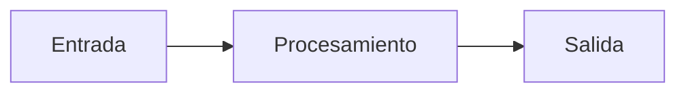

# Nombre del repositorio

Breve descripción del componente, en una o dos frases.

## Project

Este repositorio forma parte del proyecto **anySLAM**, la investigación de SLAM, navegación y
locomoción aprendida sobre el robot ANYmal D del Tecnológico de Monterrey.

[← Volver al portal principal](URL_DEL_PORTAL)

## Overview

Para qué existe este repositorio y qué problema resuelve.

## Responsibilities

Qué responsabilidades tiene este componente dentro del sistema, y cuáles explícitamente no.
Ser claro sobre lo que *no* hace evita que otros equipos asuman de más.

## Architecture

Cómo está organizado por dentro: módulos, nodos, flujo principal. Un diagrama Mermaid ayuda:



## Dependencies

| Dependencia | Versión | Para qué |
| --- | --- | --- |
| | | |

## Interfaces

Cómo se comunica este componente con el resto del sistema. **Esta es la sección más importante
del README**: sin ella, otro equipo no puede integrarse sin leer tu código.

### ROS topics

| Tópico | Tipo | Dirección | Frecuencia | Descripción |
| --- | --- | --- | --- | --- |
| | | publica / suscribe | | |

### ROS services y actions

| Nombre | Tipo | Descripción |
| --- | --- | --- |
| | | |

### Otras interfaces

APIs, sockets, puertos, archivos, sensores.

## Installation

Pasos para instalarlo desde cero en una máquina limpia.

```bash
# comandos
```

## Usage

Cómo ejecutarlo, con al menos un ejemplo concreto que funcione.

```bash
# comandos
```

## Configuration

| Variable / archivo | Valor por defecto | Descripción |
| --- | --- | --- |
| | | |

## Development

Cómo trabajar en el código localmente.

## Testing

Cómo ejecutar las pruebas.

```bash
# comandos
```

## Maintainers

- Nombre — [@usuario](https://github.com/usuario)

## Status

`Active` · `Development` · `Experimental` · `Deprecated`

*(deja solo el que aplique)*

## Related repositories

| Repositorio | Relación |
| --- | --- |
| | |
